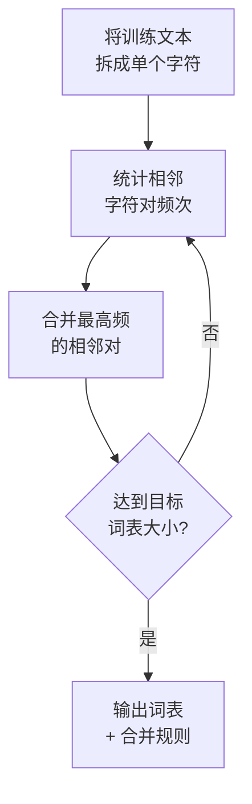

# 第 2 章 Tokenization

## 本章导引

> 你跟大模型说一句"帮我写封邮件"，它怎么就把这句话"吃"进去了？答案不是直接读文字——它先把文字切成一个个小块，这些小块叫 Token。本章从你最熟悉的"字"和"词"出发，搞清楚 Token 到底是什么、中英文分词有什么不同、为什么这会影响你花钱的多少，以及一个能省钱的技巧：Token 缓存命中。算法和公式的细节放在章末，供想深入的读者选读。

## 2.1 从"字"和"词"说起：到底什么是 Token

### 你每天都在用"字"和"词"

你从小就认识"字"和"词"。"我"是一个字，"喜欢"是一个词，"大语言模型"可以看作一个词组。你阅读时，眼睛扫过一连串的字和词，大脑自动把它们组合成意思——你从来不需要想"这句话该怎么切分"。

但计算机没有这种能力。它不认识"字"，也不认识"词"——它只认识数字。所以，在把文字交给模型之前，必须先把文字切成一个个小单元，然后给每个单元编一个号（变成数字）。

这个"小单元"，就是 Token。

### 为什么不直接按"字"或按"词"切？

你可能会想：切分文字有什么难的？按字切或者按词切不就行了。问题没那么简单。

**按字切**——把每个字都当成独立单元。"大语言模型"→ `大` `语` `言` `模` `型`，5 个 token。

问题在于太碎。"语言"本来是一个整体概念，按字切之后，"语"和"言"是两个孤立的 token，模型得花更多力气才能学会它们该一起出现。而且序列会很长——一句话 20 个字就是 20 个 token，处理起来又慢又费。

**按词切**——把每个完整的词当成一个单元。"大语言模型"→ `大语言模型`，1 个 token。

问题在于词表太大。光常用中文词就有几万到十几万，再加上人名、地名、专业术语、新造词……词表会膨胀到数十万。更麻烦的是"新词"问题：模型训练时没见过的词（比如后来才出现的"元宇宙"），它就完全不认识，只能报错或胡猜——这就是NLP（自然语言处理）领域经典的 OOV（Out-of-Vocabulary，词表外）问题。

### Token：在字和词之间的折中

Token 是介于"字"和"词"之间的单元。它有许多设计思路，一个比较普遍的是：

- 常见的字词组合，合并成一个 token（比如"语言"合成一个 token）
- 不常见的，拆成更小的子词（比如"unbelievable"拆成 `un` + `believ` + `able`）
- 实在没见过的，退回到单个字符

这样一来，三个问题都解决了：

| 问题 | 按字切 | 按词切 | Token（子词） |
|------|--------|--------|--------------|
| 词表大小 | 极小（数千） | 极大（数十万） | 适中（3~15 万） |
| 序列长度 | 太长 | 最短 | 适中 |
| 遇到新词 | 不怕（字都有） | 歇菜（不认识） | 不怕（拆成已知子词） |

用一句话总结：**Token 是模型能直接处理的最小文字单元，它比单个字符大、比完整单词小，是频次和效率之间的折中。**

你可能会问：那到底什么样的组合会被合并、什么样的会被拆开？这个决定是由分词算法在训练阶段自动做出的，核心原则就一条——**出现频率高的组合，合并；频率低的，保持拆分。** 具体算法（BPE）的细节放在本章末尾的〔深入·可选〕节，不影响你理解后面的内容。

### 分词器与词表

总的来说，分词器就是按照一定规则将输入语言转为token序列的程序，每个分词器会有自己的词表，也就是所有可能的语言单元，也是大模型的输出空间。不同模型一般维护不同的分词器。

## 2.2 中英文分词

不同语言的分词方式有很大差异。我们用几个具体例子来看。

### 英文分词

英文天然以空格分隔单词，但大模型的分词器并不会简单地按空格切——它还会把长词拆成子词：

| 原文 | 分词结果 | Token 数 |
|------|-------------------|----------|
| Hello, world! | `Hello` `,` ` world` `!` | 4 |
| tokenization | `token` `ization` | 2 |
| unbelievable | `un` `believ` `able` | 3 |
| unhappiness | `un` `happiness` | 2 |

你会发现，常见的前缀（`un-`、`re-`）和后缀（`-tion`、`-ing`、`-able`）经常被拆成独立的 token。这不是随意决定的——分词算法在训练阶段发现这些片段在语料中出现频率很高，就把它们单独收录进了词表。

一个值得注意的细节：空格在英文分词中不是"无意义的空白"，而是会被吸附到后面的 token 上。比如 ` world`（前面带空格）和 `world`（不带空格）是两个不同的 token。这也是为什么你在用 OpenAI 的 Tokenizer 工具时，会看到 token 前面经常带着空格。

### 中文分词

中文没有空格，分词器通常在字符级别工作：

| 原文 | 分词结果 | Token 数 |
|------|-------------------|----------|
| 大语言模型 | `大` `语言` `模型` | 3 |
| 我喜欢吃苹果 | `我` `喜欢` `吃` `苹果` | 4 |
| 人工智能 | `人工` `智能` | 2 |

中文的常见双字词（如"语言""模型""喜欢"）经常被合并成一个 token，但不太常见的字会单独成 token。整体来看，中文分词更依赖分词器在训练时见过的中文语料数量——语料越丰富，合并得越好，token 效率越高。

### 一个有趣的问题："strawberry"里有几个 r？

2024 年，一个有趣的现象在网上流传：你问大模型"strawberry 里有几个字母 r"，它经常答错——说只有 2 个，而实际有 3 个。

原因就在 token 化。在大多数分词器里，"strawberry" 不是一个完整的 token，而是被切成了类似 `str` `aw` `berry` 这样的子词。模型"看到"的是这三块东西，不是 s-t-r-a-w-b-e-r-r-y 这 10 个字母。它要数 r 的数量，相当于让你看着"str""aw""berry"反推原始拼写里有几个 r——这并非它擅长的任务。

这个例子很好地说明了一件事：**模型的世界里没有"字母"，只有 token。** 。

## 2.3 亲手试试：交互演示

上面的例子都是固定的，现在轮到你来试试。下面的演示允许你输入任意文字，并选择不同的分词方式来对比结果。

<ClientOnly>
  <TokenDemo />
</ClientOnly>

建议你试试这几件事：

1. **输入一段中文**，分别切换"字符级"和"BPE 子词"，观察 token 数量的差异——同样一句话，BPE 的 token 数通常比字符级少。
2. **输入一个英文长词**（如 `tokenization`），看看它被拆成了几个子词。
3. **注意统计栏右下角的词表提示**——不同分词方式对词表大小的要求天差地别。

你会发现，"字符级"的 token 数最多但词表最小，"词级"的 token 数最少但词表最大，"BPE 子词"在两者之间取得平衡——这正是BPE类算法被普遍使用的一个原因。

::: details 演示说明
本演示使用模拟的分词算法，目的是让你直观理解不同分词方式的差异，并非某个具体模型的真实分词结果。不同模型（GPT、Claude、Qwen 等）的词表和合并规则各不相同，但基本原理一致。如果你想查看某个模型的精确分词结果，可以使用 OpenAI 的 [Tokenizer](https://platform.openai.com/tokenizer) 在线工具。
:::


## 2.4 Token 缓存命中

如果你使用过deepseek等模型的api，一定会发现，里面有一个单独的缓存命中的定价，我们这里对其做一个简单的叙述。

### 什么是缓存命中？

假设你在用 API 开发一个客服机器人。每次用户提问，你都会发送一段相同的系统提示，比如"你是一个专业的客服，请礼貌地回答用户问题……"。这段提示可能有 500~2000 个 token，每次请求都一模一样。

如果每次调用都从头计算这段提示的内部表示，那太浪费了——因为模型对同一段文字的中间计算结果（KV Cache）是可以复用的。

这就是**前缀缓存**（Prefix Caching）的核心思路：**如果多次请求共享相同的前缀（即开头部分），服务端可以把前缀的计算结果缓存起来，下次遇到相同前缀就直接复用，不必重新计算。** [6]

### 命中了能省多少？

当缓存命中时，效果是立竿见影的：

- **更快**：首 token 延迟（TTFT，Time To First Token）可降低 50%~85%，因为跳过了前缀的计算 [6]
- **更便宜**：缓存命中的输入 token 通常享受折扣——OpenAI 对缓存命中的 token 给予 50% 折扣，Anthropic 更是给予 90% 折扣 [6]

在生产环境中，把不变的内容放前面、每次变化的内容放后面，缓存命中率可以从 0% 提升到 90% 以上，整体输入成本降低 80%~90% [6]。

### 怎么才能命中？

命中与否取决于不同模型的缓存规则。
以前缀缓存为例，可以粗糙地这样理解：**把不变的内容放在 prompt 的开头，把每次变化的内容放在末尾。**

比如，不要这样组织 prompt：

```text
[用户问题] + [系统提示] + [检索结果]
```

而应该这样：

```text
[系统提示] + [检索结果] + [用户问题]
```

前一种写法，每次用户问题不同，prompt 的开头就变了，缓存永远命不中。后一种写法，系统提示是固定的，至少这部分每次都能命中。

### 这个话题的完整展开

Token 缓存命中涉及 KV Cache 的底层机制、推理引擎的调度策略，以及 harness 如何组织 prompt 结构——这些内容技术性较强，会在本书**第三层（走向实践）**中详细展开。

## 2.6〔深入·可选〕BPE 算法详解与特殊 Token

> 这一节是给"想看看分词算法具体怎么运作"的读者准备的。如果此刻你只想先建立直觉，完全可以跳过，等需要时再回来看——不影响后续章节的阅读。

### BPE 的核心思想

BPE（Byte Pair Encoding，字节对编码）最早由 Gage（1994）提出，是一种数据压缩算法 [1]。Sennrich 等人（2016）将其引入自然语言处理领域，用于解决机器翻译中的稀有词问题 [2]。

它的核心思路非常简单：**从把所有文字拆成单个字符开始，反复合并出现频率最高的相邻字符对，直到达到目标词表大小。**

### 一个完整的 BPE 合并过程

假设训练语料里有三个词："low"（出现 5 次）、"lower"（出现 2 次）、"lowest"（出现 3 次）。BPE 的训练过程如下(以字符为例，实际是对字节进行操作)：
**初始状态**——全部拆成单个字符：

| 词 | 字符序列 | 出现次数 |
|----|---------|---------|
| low | `l` `o` `w` | 5 |
| lower | `l` `o` `w` `e` `r` | 2 |
| lowest | `l` `o` `w` `e` `s` `t` | 3 |

**第 1 轮**——统计所有相邻字符对的频次，合并最高频的对：

- `l` + `o`：出现 5+2+3 = **10 次** ← 最高频
- `o` + `w`：出现 10 次
- `w` + `e`：出现 2+3 = 5 次
- `e` + `r`：出现 2 次
- `e` + `s`：出现 3 次
- ……

合并 `l` + `o` → `lo`：

| 词 | 合并后 | 次数 |
|----|--------|------|
| low | `lo` `w` | 5 |
| lower | `lo` `w` `e` `r` | 2 |
| lowest | `lo` `w` `e` `s` `t` | 3 |

**第 2 轮**——合并 `lo` + `w` → `low`（出现 10 次）：

| 词 | 合并后 | 次数 |
|----|--------|------|
| low | `low` | 5 |
| lower | `low` `e` `r` | 2 |
| lowest | `low` `e` `s` `t` | 3 |

**第 3 轮**——合并 `e` + `s` → `es`（出现 3 次），或 `e` + `r` → `er`（出现 2 次），取决于频次排序。假设合并 `e` + `s`：

| 词 | 合并后 | 次数 |
|----|--------|------|
| low | `low` | 5 |
| lower | `low` `e` `r` | 2 |
| lowest | `low` `es` `t` | 3 |

如此反复，直到达到预设的词表大小。最终词表里既有单个字符（如 `l`、`o`），也有合并后的子词（如 `low`、`er`、`es`），还有可能合并出的完整词。

整个过程用流程图表示：



BPE 的精妙之处在于它是**数据驱动**的：哪些字符对应该合并，完全由语料中的出现频率决定。高频组合自然成为词表的一部分，低频组合则保持拆分状态。这就是为什么"the""ing""tion"这些片段在英文词表里都是独立 token——它们在语料中出现得太频繁了。

实际使用时，分词器拿着训练好的合并规则表，对新的文本逐对检查：能合并的就合并，不能合并的保持拆分。这是一个确定性的过程——同样的文本，用同样的词表，总是得到同样的 token 序列。

### 其他分词算法

BPE 不是唯一的子词分词算法。常见的还有几种：

| 算法 | 核心思路 | 代表模型 |
|------|---------|---------|
| BPE | 按频次合并字符对 | GPT 系列、Llama |
| WordPiece | 按最大似然增益合并 | BERT [3] |
| Unigram | 从大词表逐步删除低频子词 | T5、mT5 [4] |
| SentencePiece | 不依赖空格的通用分词框架 | Llama、Qwen [3] |

其中 SentencePiece 是一个语言无关的分词工具包，内置了 BPE 和 Unigram 等算法实现，其核心特点是直接在原始文本（或字节）流上训练，无需预先按空格分词——这对中文、日文等无空格语言特别重要 [3]。

### 特殊 Token

除了从文本中学习到的普通 token，每个模型的词表里还有一些**特殊 token**（Special Tokens）。它们不是从文本中切出来的，而是人为添加的控制标记：

| 特殊 Token | 含义 | 作用 |
|-----------|------|------|
| `<BOS>` | Beginning of Sequence | 标记序列开头 |
| `<EOS>` | End of Sequence | 标记序列结尾，模型生成到此停止 |
| `<PAD>` | Padding | 填充短序列，使同一批次内序列等长 |
| `<UNK>` | Unknown | 未在词表中的内容的兜底标记 |

>在现代 Byte-level BPE 分词器（如 GPT-2+、Qwen）中，由于以字节为底座，理论上不会出现 OOV，因此 <UNK> 往往`<UNK>`不被使用或仅保留作兼容用途

不同模型使用的特殊 token 方案不同。例如，GPT 系列用 `<|endoftext|>` 作为序列结束标记，Qwen 系列用 `<|im_start|>` 和 `<|im_end|>` 来标记对话轮次的起止。这些特殊 token 在训练阶段就被纳入词表，模型学会了识别它们的控制含义——这也是 harness（第 1 章介绍的概念）能对模型行为进行结构化控制的基础之一。

## 本章小结

- **Token 是模型处理文字的基本单元**，介于字符和词之间，是频次和效率的折中——常见组合合并成 token，罕见词拆成子词，完全没见过的退回字符。
- **中英文分词机制不同**：英文天然有空格，分词器在词级别拆分子词；中文无空格，分词器在字符级别合并。这导致同样意思的内容，在未针对中文优化的模型中，中文 token 消耗约为英文的 2~4 倍；而在国产大模型或中文增强词表中，该比例可降至 1.0~1.5 倍。实际上的token消耗和推理效率也有关系，英文相对更适合推理，而中文推理需要耗费更多的语义。
- **Token 效率影响成本和上下文利用率**：中文 token 效率低于英文，直接影响 API 花费和上下文窗口的有效容量。国产模型在词表设计上对中文做了优化。
- **前缀缓存可以省钱**：相同的前缀（如系统提示）只需计算一次，后续请求可复用缓存，命中时更快（TTFT 降低 50%~85%）更便宜（输入 token 折扣 50%~90%）。尤其是在agent使用中，面对反复填充的上下文，如何提高缓存命中是成本和效率的关键。
- **Byte-level BPE 是大模型最常用的分词算法**：从字节开始，反复合并最高频的相邻对，数据驱动地构建词表。WordPiece、Unigram、SentencePiece 是其他常见方案。

## 参考文献

[1] Gage, P. A New Algorithm for Data Compression. The C Users Journal, 12(2): 23-38, 1994.

[2] Sennrich, R., Haddow, B., & Birch, A. Neural Machine Translation of Rare Words with Subword Units. Proceedings of the 54th Annual Meeting of the ACL, 2016. https://arxiv.org/abs/1508.07909

[3] Kudo, T. & Richardson, J. SentencePiece: A Simple and Language Independent Subword Tokenizer and Detokenizer for Neural Text Processing. Proceedings of the 2018 Conference on EMNLP, 2018. https://arxiv.org/abs/1808.06226

[4] Kudo, T. Subword Regularization: Improving Neural Network Translation Models with Multiple Subword Candidates. Proceedings of the 56th Annual Meeting of the ACL, 2018. https://arxiv.org/abs/1804.10959

[5] Schuster, M. & Nakajima, K. Japanese and Korean Voice Search. IEEE International Conference on Acoustics, Speech and Signal Processing (ICASSP), 2012.

[6] OpenAI. Prompt Caching. https://platform.openai.com/docs/guides/prompt-caching
