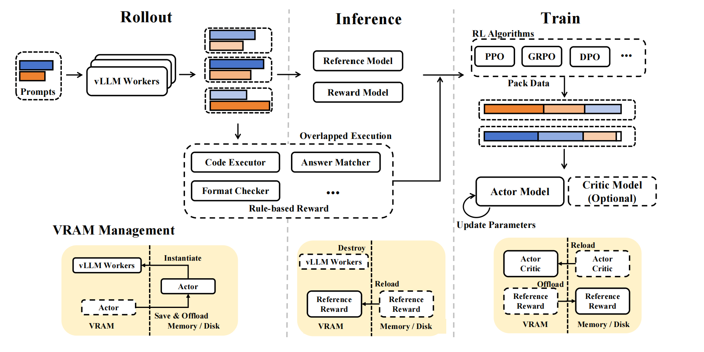
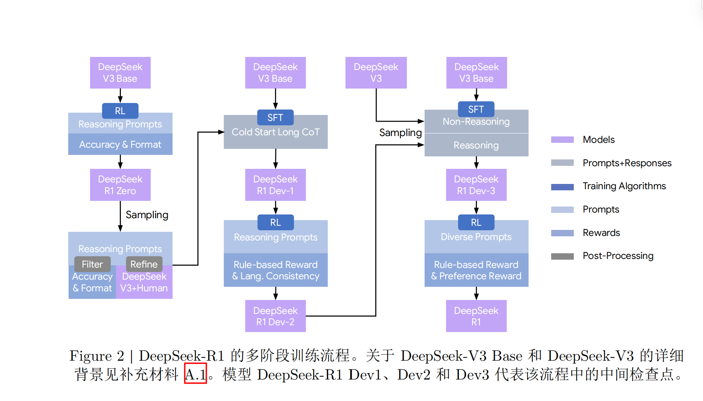

# DeepSeek-R1 技术报告 阅读笔记

> 论文链接：[deepseek-r1](https://arxiv.org/abs/2501.12948)，此次阅读的是 v2 版本。

## deepseek-r1-zero

采样纯强化学习策略训练，无监督微调，具体算法为**组相对策略优化(GRPO)**。

> 组相对策略是以同问题的多次采样的组内信息取代PPO的critic网络来进行基准校对，从而更加轻量化且性能未下降的一种策略优化方法。

### 训练设置

学习率设置为 3e-6，KL 系数设置为 0.001，rollout 采样温度为 1。
在8,200步之前每个问题采样16个输出，最大长度规定为32,786 token。之后最大长度调整为65,536 token。

> 每个step为一次策略更新的过程，每个epoch代表总训练数据遍历一遍。

共训练10,400步，每个训练步有32个不同的问题（训练批次大小为32\*16=512），值得注意的是，每400步即将参考模型替换为最新的策略模型（从而允许更大的搜索范围）。为加速训练，每次rollout 生成8,192个输出，划分为16个mini-batch（16\*512），且只训练一轮。

#### RL Infra

**Rollout生成模块**：prompt分批发放给vLLM worker，每个worker用当前actor（策略模型）权重采样分布，采用专家并行及MTP自解码等提速。

**Inference打分模块**：VRAM（显存）换入reference+reward模型，对prompt和response做前向，以计算KL loss和基准奖励。

**规则奖励**：CPU执行，与Rollout和Inference并行，每条回复生成完即可验证，输出只用在train计算;loss前汇合即可。

**Train更新模块**：按照预设算法根据输入（奖励+参考log-prob），将data（主体为input=prompt+response，一起喂给Actor模型，这样可以一次性得到所有response位置上的prob）打包，具体的打包方式见下方注释，模型做前向后向更新权重。

**显存管理**：Actor->Reward+reference->Actor

> - vllm是分页缓存和连续批处理的高效推理架构，这里用来加速rollout生成。
> - MTP 自推测解码：deepseek-v3自带原生多token预测头，即生成多个draft tokrn，若验证可行即采用，不可采用就回退。
> - pack data:全局batch是一个以不定长input为主体的张量，原始需要每个张量长度相等，如果直接按照单独input组装张量，会产生大量的pad，于是将复数input按照装箱算法拼接（计算可行性见下方注释），并尽量让不同rank的mini batch数相近（减少通信气泡）。
> -  DualPipe：deepseek的双向调度算法。

> 关于input的拼接的计算可行性：
> **Linear** $Y=X\cdot W$，每个token（即每行）的计算和输出的完全对应的，token之间不会干扰。
> **Norm** Layer/RMS都是对各行单独做的
> **RoPE** Position_id在各段开始时计0
> **Attention** 由flash attention varlen kernel保证
> **反向传播** 逻辑类似

> DualPipe：stage指的是PP（流水线并行）下的切分子块，即模型的某些层（如果TP那就是一个TP group），DualPipe是一个复杂的双向流分布式调度方法，在deepseek-v3论文中提出，此处暂略。

### 奖励设计

> RLVF，基于规则验证器的奖励。

这里主要设计了准确性奖励以及格式奖励，最终按照一定的权重组合。

相比于神经网络奖励，优点是奖励明确，不会出现reward hacking的情况，且没有计算上的负担；缺点是只能处理数学或者程序等好坏明确的问题。

### 激励LLM的推理能力

总而言之，随着训练的进行，强化学习激励模型自主地延长了推理时间，并提升了解决问题的准确率（pass@1,cons@16等指标）。

> 自一致性解码：生成多次回答并选取其中频率最多的回答作为最终答案。

## deepseek-r1

### 基于模型的奖励

对于通用数据的偏好，依然要用模型来捕捉。

这里考虑了有用性与无害性。

#### 有用性奖励模型

$$Reward_{helpful}=RM_{helpful}(Response_A,Response_B)$$

按照arena-hard格式生成偏好对（每队含一个查询和两个候补回复），通过judge prompt让v3对其评判4次（这里通过随机分配候补回复在judge prompt中的顺序缓解**位置偏差**），最终取分数差超过1的对的均值作为最终偏好分数。通过确保数据集被选和被拒的回复长度相当来最小化**长度偏差**。

架构在R1的基础上添加一个预测标量偏好分数的奖励头。

训练：批次大小256，学习率6e-6，训练一个epoch。训练期设置最大序列长度为8192token，推理期间不显式限制。

#### 安全性奖励模型

$$Reward_{safety}=RM_{safety}(Response)$$

收集了10,600条提示，并按照预定义安全指南将其标注为安全或不安全。

### 训练

#### 第一阶段RL

学习率设置为 3e-6，KL 系数设置为 0.001，GRPO **裁剪比 $𝜀$ 设置为 10**，rollout 采样温度为 1。对于每个问题，采样 16 个输出，最大长度为 32,768。每个训练步由 32 个不同问题组成，因此每步训练批次大小为 512。每 400 步，将参考模型替换为最新的策略模型。为加速训练，每次 rollout 生成 8,192 个输出，随机划分为 16 个 minibatch，仅训练一个内部轮次。

上述同r1-zero无明显区别，这里特殊的一点是加入了语言一致性奖励，奖励设置为目标词语占思维链的比例。

消融实验表示语言一致对齐会导致模型训练略微下降，但是可以增强可读性。

裁剪比的设置至关重要，较低会导致梯度截断（低概率token的更新空间太窄了），较高会导致训练不稳定。

#### 第二阶段RL

采用多种奖励信号和多样化提示分布组合来训练模型。对于推理数据，采用基于规则的奖励；对于通用数据，采用奖励模型以及格式奖励。此外还有针对语言的奖励。

参数的关键区别在于温度改为了0.7。包含了1700个训练步，通用奖励和偏好奖励在**最后400步纳入**。

基于模型的偏好奖励信号容易引发reward hack。
