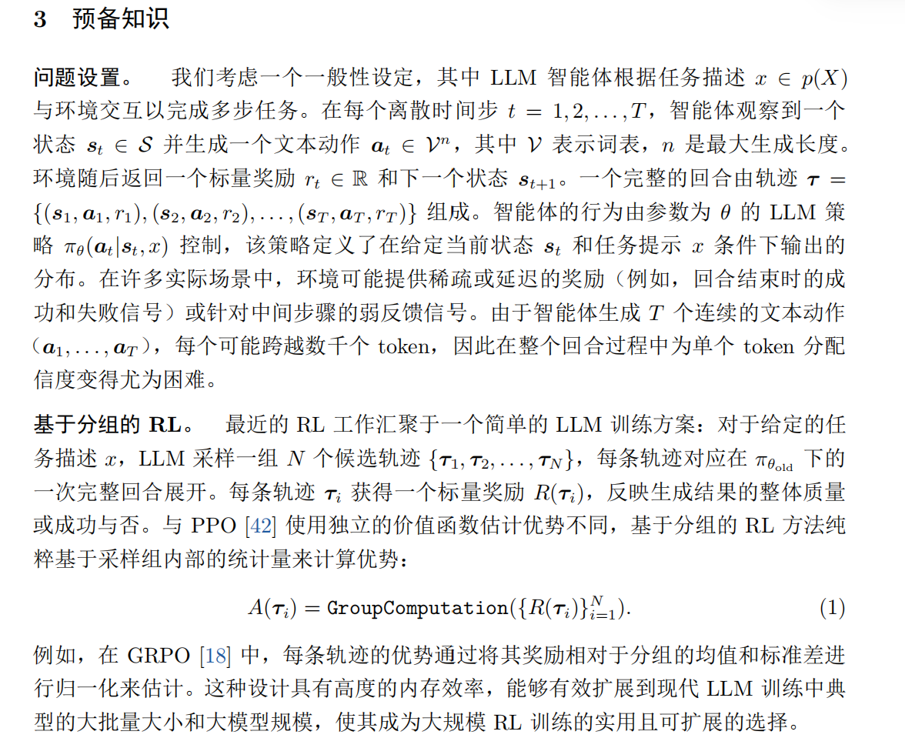
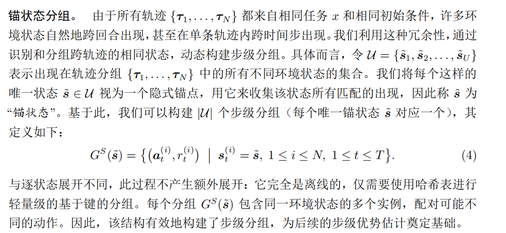
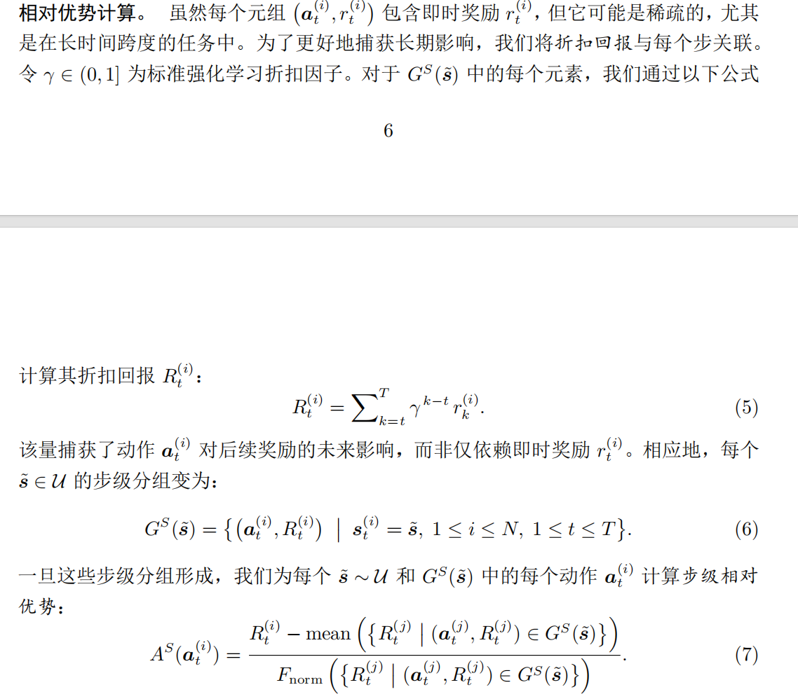
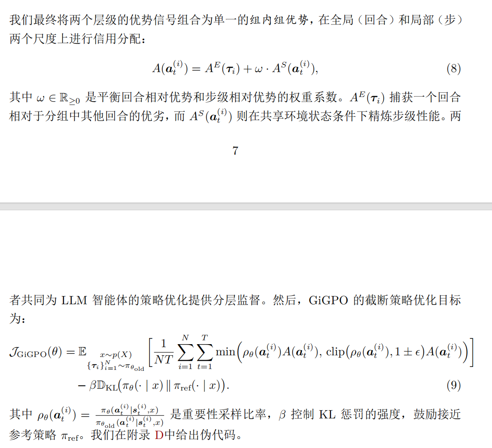
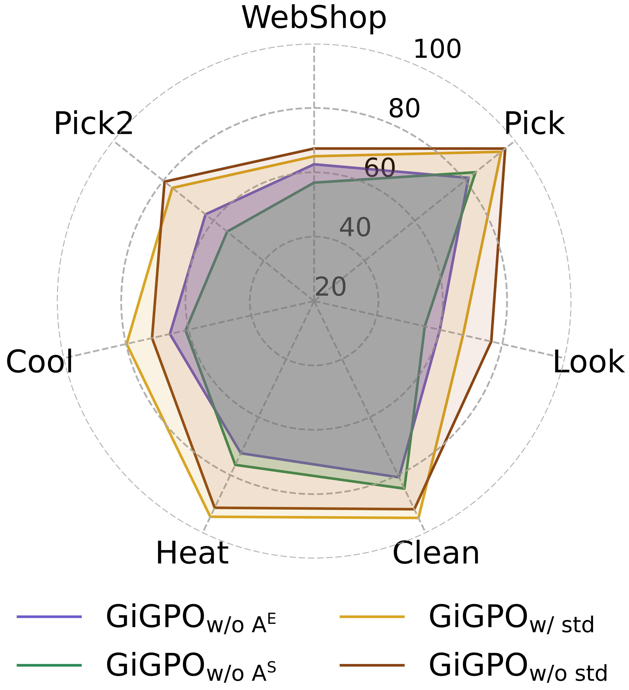

## GiGPO

核心贡献是在保留GRPO的优点的同时，为LLM智能体训练引入更加细致的**信度分配**（step层面）。

背景是LLM智能体训练的轨迹较长，且奖励比较稀疏。

- 1. 回合层面，从**相同任务和初始状态条件**下出发采样一组估计，基于总回报计算宏观相对优势。和标准GRPO相似。
- 2. 步骤层面，引入**锚点状态分组**机制，它回溯性地识别跨轨迹重复出现的环境状态，称之为*锚点状态*，并将它们作为锚点来构建*步骤级分组*，从而实现局部信度分配。

>解释：该论文的动机是，在长程agent的同一组轨迹中，轨迹内或者轨迹之间会重复出现很多次重复的状态，将重复状态后的动作聚合为组。

>本质是想办法为更细的粒度找到评判好坏的标准，这里相同状态就提供了一个基准，从而判断重复状态下哪些动作更好。

### GiGPO训练agent

#### 回合相对优势

考虑到低方差分组，可以考虑将分组优势的分母设为1（原为std）

#### 步级相对优势

所谓奖励稀疏，即中间的即时奖励为0，所以这里用discount return代替。

#### 公式

### 实验

(1)GiGPO 在训练 LLM 智能体方面的强大能力；
(2)GiGPO 的消融研究；
(3) 步级分组 $ G^S(\tilde{s}) $在训练过程中的动态趋势；
(4)GiGPO 的计算开销。

在*ALFWorld*和*WebShop*上面进行智能体训练，以及一系列*baseline*（闭源模型，react/reflection等无需更新参数的方法，RL如PPO,RLOO,GRPO。以及搜索增强回答的特定方法）

**训练细节**：basemodel为Qwen2.5-1.5B/3B/7B-Instruct，$\omega$设为1，分组大小设为8。此外，对锚点状态引入基于相似度的模糊匹配（最长匹配子序列超过0.9视为同一状态）

#### 消融

对$F_norm=1/std$以及分别去除步级和回合相对优势，使用Qwen2.5-1.5B-Instruct作为策略模型。

### 优势与局限

在本工作中，我们提出了 GiGPO，一种新型的基于分组的强化学习算法，用于解决长周期 LLM 智能体训练中的信用分配挑战。GiGPO 引入了层次化优势估计，能够实现细粒度的逐步信用分配，同时保持基于分组的强化学习的效率和稳定性。通过回顾性地将不同轨迹中共享相同状态的步骤进行分组，该方法在不产生额外 LLM rollout 或 GPU存开销的情况下实现了这一目标。在复杂智能体环境（ALFWorld 和 WebShop）以及搜索增强问答任务上的实验评估表明，GiGPO 显著优于基于提示的智能体和先前的强化学习方法。GiGPO 的一个潜在局限性在于其依赖状态匹配来构建锚点组。在高度复杂的环境中，由于噪声或细微差异，完全相同的状态可能难以被检测到。尽管如此，GiGPO 仍然保留了较强的性能下界：在没有任何状态在轨迹间重复的极端情况下（即$A^S$ = 0），它会自然退化为 GRPO，保持 GRPO 在信用分配上的有效性和稳定性。

虽然通过引入基于相似性的分组可以部分缓解这一问题，但探索更鲁棒的状态匹配策略，例如基于嵌入的表示或领域特定的结构等价性，仍然是一个重要的研究方向。

### 附录

见原PDF，包含了训练的伪代码，具体的超参数设置，提示词，以及在评测集中具体的推理行为等
