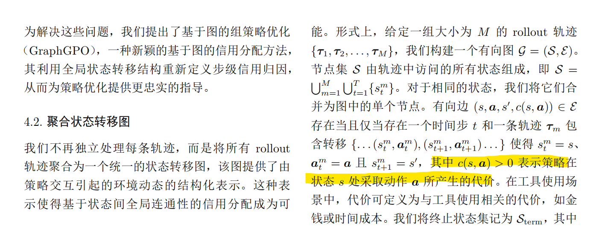
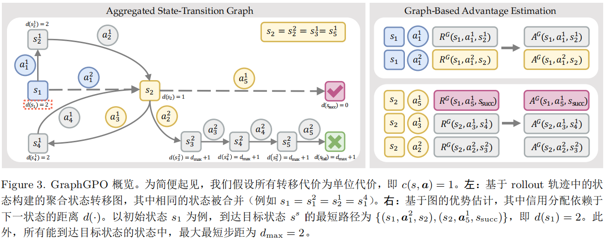
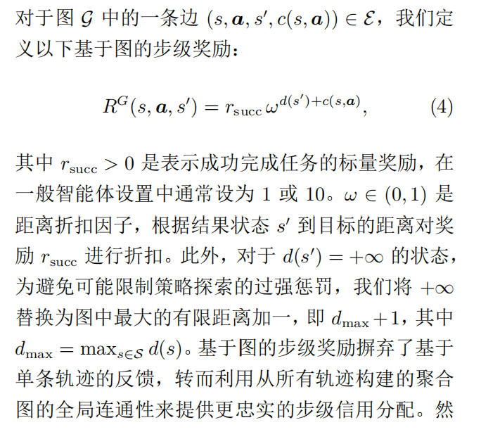
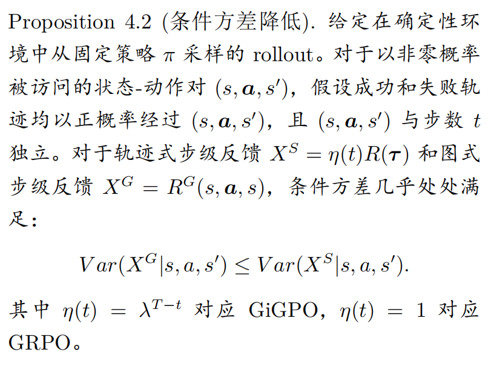

## Graph-GPO

### Introduction

将rollout轨迹聚合为状态转移图，动作为边。依据转移对缩短到任务目标的距离来分配信用。

这里阐述了一个问题，即失败的trace中也会有相当比例的有用动作，相对的，成功的trace中也会有相当数量的无用或不合适的动作。因此仅根据结果来分配信用是有极大的偏差的。

### 方法

#### trace归因的局限

如上

#### 聚合状态转移图

终止状态集包括成功状态以及超出最大长度的状态（即失败）

#### 基于图的优势估计

$$
d(s) = \begin{cases}
0, & \text{if } s = s_{\text{succ}}, \\
\min\limits_{(s,a,s',c) \in \mathcal{E}} \left( c(s, \boldsymbol{a}) + d(s') \right), & \text{if } s \rightsquigarrow s_{\text{succ}}, \\
+\infty, & \text{otherwise},
\end{cases}
$$

然后对每个状态的连接边计算组优势。

**prop: 优势对距离成本和是单调的。**

给出了一个条件方差降低的好处。
