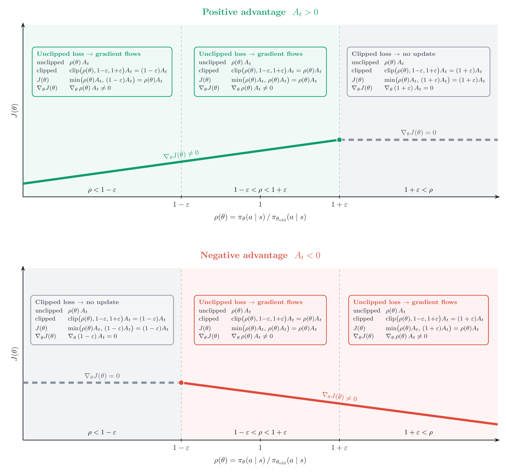
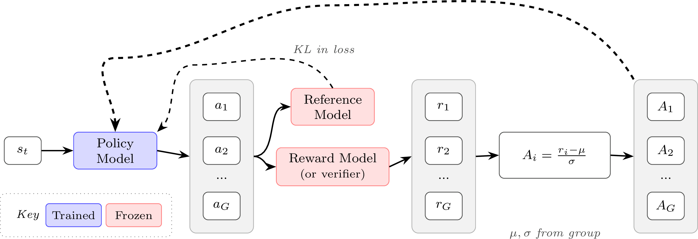

## 强化学习


### 策略梯度算法
>强化学习中策略梯度优化是指，通过优化策略函数的参数来寻求最优策略的一类方法。

我们先对优化目标$J(\theta)$做一个讨论。

自然地，定性为最大化给定状态分布以及当前策略$\pi_{\theta}$下状态价值的期望值。
由状态价值的定义$V_{\pi_{\theta}}(s)=\mathbb{E}_{\pi_{\theta}}(R(\tau)|s)$，这里的$R$是轨迹$\tau$的return
**随机性**，不难看出$J(\theta)=\mathbb{E}_sV_{\pi_{\theta}}(s)$有两层随机性，一是对状态s的随机，这个在实际中可以体现为从批次中采样$x_i$，二是对固定初始状态下的轨迹的随机，即固定$x_i$下生成不同回答$y_i$的可能性。

实际中，令$R(x_i,y_i)$为该轨迹下的return，具体的优化目标与批次和奖励的具体形式有关，比如可以对上述$R(x_i,y_i)$做批次平均。

>在将词元作为最小生成来作MDP推演时，一般将折扣因子设为1，因为我们关注的目标是生成整体。

#### 策略梯度的推导

令$p_{\theta}(\tau)$表示初始状态分布、策略以及环境共同诱导出的轨迹的概率分布（注意此处的$\tau$吸收了前述初始状态$s$的随机），从而有：
$$J(\theta)=\mathbb{E}_{\tau \sim p_{\theta}}[R(\tau)]$$

有$p_{\theta}(\tau)=d_0(s_0)\prod_{t=0}^{\infty}\pi_{\theta}(a_t|s_t)p(s_{t+1}|a_t,s_t)$

使用$\nabla f=f\nabla \text{log}f$的技巧，得到：

$$
\nabla_{\theta}J(\theta)=\mathbb{E}_{\tau \sim p_{\theta}}[R(\tau)\nabla_{\theta} \text{log}p_{\theta}(\tau)]
$$

简化中间过程，大致是$p$中只有$\pi$是含参的，化简之后得到：

$$
\nabla_{\theta}J(\theta)=\mathbb{E}_{\tau \sim p_{\theta}}[\Sigma_{t=0}^{\infty}R(\tau)\nabla_{\theta} \text{log}\pi_{\theta}(a_t|s_t)]
$$

，稍加推广得到:

$$
\nabla_{\theta}J(\theta)=\mathbb{E}_{\tau \sim p_{\theta}}[\Sigma_{t=0}^{\infty}\Psi_t\nabla_{\theta} \text{log}\pi_{\theta}(a_t|s_t)]
$$

其中，$\Psi_t$ 表示用于策略梯度估计的回报信号；有些奖励均采用折扣因子 $\gamma$。常见选择依次为：

1. **轨迹总回报**
   $$
   \Psi_t = R(\tau)=\sum_{t'=0}^{\infty}\gamma^{t'}r_{t'}.
   $$
   整条轨迹中的折扣奖励之和。

2. **从时刻 \(t\) 开始的回报**
   $$
   \Psi_t = G_t=\sum_{t'=t}^{\infty}\gamma^{t'-t}r_{t'}.
   $$
   表示执行动作 \(a_t\) 后、从当前时刻起获得的未来折扣回报。

3. **带基线的回报**
   $$
   \Psi_t = G_t-b(s_t).
   $$
   在回报中减去仅依赖状态的基线 \(b(s_t)\)，不会改变梯度估计的期望，但能降低方差。

4. **状态—动作价值**
   $$
   \Psi_t=Q^\pi(s_t,a_t).
   $$
   表示在状态 \(s_t\) 采取动作 \(a_t\) 后，后续回报的期望。

5. **优势函数**
   $$
   \Psi_t=A^\pi(s_t,a_t)=Q^\pi(s_t,a_t)-V^\pi(s_t).
   $$
   衡量动作 \(a_t\) 相对于该状态下策略平均表现的增益；若能准确估计，通常具有更低的梯度方差。

6. **时序差分（TD）残差**
   $$
   \Psi_t=\delta_t=r_t+\gamma V^\pi(s_{t+1})-V^\pi(s_t).
   $$
   它比较价值函数的当前预测与一步 bootstrap 目标，常用于近似优势函数。

其中，
$$
V^\pi(s_t)=\mathbb{E}_{a_t\sim\pi(\cdot\mid s_t)}[Q^\pi(s_t,a_t)]
$$
是状态价值，表示在 \(s_t\) 下遵循策略 \(\pi\) 的期望回报；而
$$
Q^\pi(s_t,a_t)=\mathbb{E}[r_t+\gamma V^\pi(s_{t+1})\mid s_t,a_t]
$$
是状态—动作价值。于是，优势函数可写为
$$
A^\pi(s_t,a_t)=r_t+\gamma V^\pi(s_{t+1})-V^\pi(s_t),
$$
即一步 TD 残差。*这是因为在确定性环境中，上式不再需要对状态转移取期望*。

#### 朴素策略梯度

一个关于时刻t的简单版本为：

$$
\nabla_{\theta}J(\theta)=\mathbb{E}_{\tau \sim p_{\theta}}[\Sigma_{t=0}^{T}G_t\nabla_{\theta} \text{log}\pi_{\theta}(a_t|s_t)]
$$

简单地用当前轨迹的生成token来进行计算，即$G_t=\Sigma_{k=t}^{T_i}\gamma^{k-1}r_{i,k}$。这里每个token的分数取决于怎么将RM的分数分配到每个分数上（比如中间token置0，只分配给最后的token）。

一个众所周知的问题，由于缺少基线，朴素策略梯度的方差极大，缓解的方式有优势函数（PPO），组平均值（GRPO）等。


#### REINFORCE

#####  核心思想

REINFORCE 是最基本的策略梯度方法之一，其核心思想是：

> **提高获得高于预期回报的动作的概率，降低获得低于预期回报的动作的概率。**

早期 REINFORCE 的参数更新可以概括为：

$$
\Delta \theta
=
\alpha (r-b)e
$$

其中：

- $\alpha$：学习率；
- $b$：基线（baseline），用于降低梯度估计的方差；
- $r-b$：奖励相对于基线的增量；
- $e$：资格迹（eligibility），表示奖励应归因于哪些参数。

#####  现代策略梯度形式

对于策略 $\pi_\theta(a_t\mid s_t)$，使用从时刻 $t$ 开始的回报 $G_t$，REINFORCE 的策略梯度为：

$$
\boxed{
\nabla_\theta J(\theta)
=
\mathbb E_{\tau\sim\pi_\theta}
\left[
\sum_{t=0}^{T}
\left(G_t-b(s_t)\right)
\nabla_\theta
\log\pi_\theta(a_t\mid s_t)
\right]
}
$$

其中：

- $G_t$：动作 $a_t$ 之后获得的累计回报；
- $b(s_t)$：状态相关的 baseline；
- $\nabla_\theta\log\pi_\theta(a_t\mid s_t)$：调整该动作概率的方向。

#####  使用优势函数表示

定义优势：

$$
A_t=G_t-b(s_t),
$$

则 REINFORCE 可以简写为：

$$
\boxed{
\nabla_\theta J(\theta)
=
\mathbb E_{\tau\sim\pi_\theta}
\left[
\sum_{t=0}^{T}
A_t
\nabla_\theta
\log\pi_\theta(a_t\mid s_t)
\right]
}
$$

因此：

$$
A_t>0
\quad\Rightarrow\quad
\text{提高 }a_t\text{ 的概率},
$$

$$
A_t<0
\quad\Rightarrow\quad
\text{降低 }a_t\text{ 的概率}.
$$

REINFORCE 的核心可以概括为：

$$
\boxed{
\text{优势 }A_t
\times
\text{对数策略梯度 }
\nabla_\theta\log\pi_\theta(a_t\mid s_t)
}
$$

即用优势决定动作应该被**鼓励还是抑制以及更新强度**，再通过对数策略梯度更新模型参数。


#### REINFORCE留一法（RLOO）

优势$A_t=G_t-b(s_t)$

留一法的前提是：对一个提示生成了多条轨迹。

显然，即利用其余轨迹的均值作为当前轨迹return的基线。

>优势通过整个生成的奖励来计算，具体分不分配到token上是单纯的处理。一般会将并入KL惩罚后得到的优势广播到每个token

值得注意的是，RLOO以及传统的策略梯度将KL惩罚加到奖励上，而GRPO则在损失层面施加KL惩罚。

#### PPO近端策略优化


PPO 的裁剪代理目标为：

$$
J(\theta)
=
\mathbb{E}_t
\left[
\min\left(
\rho_t(\theta)A_t,\,
\operatorname{clip}\big(\rho_t(\theta),1-\epsilon,1+\epsilon\big)A_t
\right)
\right],
$$

其中

$$
\rho_t(\theta)
=
\frac{\pi_\theta(a_t\mid s_t)}
{\pi_{\theta_{\mathrm{old}}}(a_t\mid s_t)}.
$$

- $\pi_{\theta_{\mathrm{old}}}$：采集当前这批数据时的旧策略；
- $\pi_\theta$：正在更新的当前策略；
- $A_t$：优势函数；
- $\rho_t$：新旧策略对同一动作概率的比值。

$\rho_t$ 的作用是修正**采样分布偏差**。数据来自旧策略：

$$
a_t\sim\pi_{\theta_{\mathrm{old}}}(\cdot\mid s_t),
$$

但我们希望优化当前策略 $\pi_\theta$。由于

$$
\pi_\theta\neq\pi_{\theta_{\mathrm{old}}},
$$

旧数据的采样分布与当前策略不一致。因此使用重要性采样比率

$$
\rho_t
=
\frac{\pi_\theta(a_t\mid s_t)}
{\pi_{\theta_{\mathrm{old}}}(a_t\mid s_t)}
$$

重新调整旧样本的权重，使其可以用于估计当前策略的目标。

需要注意，**$\rho_t$ 修正的是旧数据的统计权重，而不是消除新旧策略之间的差异**。事实上，$\rho_t$ 本身也反映了这种差异：

$$
\rho_t\approx1
\quad\Rightarrow\quad
\text{新旧策略接近},
$$

而 $\rho_t$ 明显偏离 $1$，说明当前策略已经明显偏离采样时的旧策略。


PPO 通常会对**同一批轨迹进行多次梯度更新**，主要目的是提高样本利用率，因为强化学习中的环境采样通常比对已有数据进行梯度计算更加昂贵。

一批数据由 $\pi_{\theta_{\mathrm{old}}}$ 采集后，在若干次更新中保持旧策略不变：

$$
\theta^{(0)}=\theta_{\mathrm{old}}
\rightarrow
\theta^{(1)}
\rightarrow
\theta^{(2)}
\rightarrow
\cdots
$$

每次都计算

$$
\rho_t^{(k)}
=
\frac{\pi_{\theta^{(k)}}(a_t\mid s_t)}
{\pi_{\theta_{\mathrm{old}}}(a_t\mid s_t)}.
$$

第一次更新前：

$$
\rho_t^{(0)}=1.
$$

随着多次梯度更新，$\pi_{\theta^{(k)}}$ 会逐渐偏离 $\pi_{\theta_{\mathrm{old}}}$，因此 $\rho_t$ 也逐渐偏离 $1$。

虽然重要性采样可以修正这种分布差异，但当新旧策略相差过大时，$\rho_t$ 可能非常大或非常小，使估计方差增大、训练不稳定。因此 PPO 使用裁剪：

$$
\operatorname{clip}(\rho_t,1-\epsilon,1+\epsilon)
$$

限制旧数据推动策略继续变化的程度。



- 正优势 \(A_t>0\)：该动作比平均水平好，因此希望提高其概率，即推动 \(\rho_t\) 增大。但当
  \[ \rho_t>1+\epsilon \]
  时，说明该动作的概率已经提高得足够多，目标函数变平、梯度变为 \(0\)，不再继续强化。
- 负优势 \(A_t<0\)：该动作比平均水平差，因此希望降低其概率，即推动 \(\rho_t\) 减小。但当
  \[ \rho_t<1-\epsilon \]
  时，说明该动作的概率已经降低得足够多，目标函数同样变平、梯度变为 \(0\)，不再继续抑制。
因此图中倾斜部分表示梯度正常传播，推动策略朝改善方向更新；水平部分表示裁剪生效，该样本不再提供进一步推动策略远离旧策略的梯度。
需要注意，PPO 并不是强制要求
\[ 1-\epsilon\le \rho_t\le1+\epsilon, \]
而是当策略已经沿着有利方向变化过大时停止该样本的进一步激励。因此，\([1-\epsilon,1+\epsilon]\) 更准确地说是一个软性的更新限制区域，而不是对策略比值施加的硬约束。

##### 价值函数/critic network

PPO 中的价值函数（Critic）用于预测从当前状态 $s_t$ 出发，在当前策略下未来能够获得的期望累计回报：

$$
V^\pi(s_t)
=
\mathbb{E}_\pi
\left[
\sum_{k=t}^{T}\gamma^{k-t}r_k
\mid s_t
\right].
$$

对于语言模型，$s_t$ 表示当前已经生成的 token 序列，因此 Critic 会为每个 token 位置预测一个标量 $V_\phi(s_t)$。

价值函数主要作为策略梯度的**基线（baseline）**。实际回报相对于价值预测的差异形成优势：

$$
A_t \approx Q(s_t,a_t)-V(s_t),
$$

其中 $A_t>0$ 表示该动作的表现好于预期，$A_t<0$ 表示差于预期，从而指导 Actor 更新策略。

###### Critic 的训练

最简单的方法是使用实际累计回报（Monte Carlo Return）作为训练目标：

$$
G_t
=
r_t+\gamma r_{t+1}+\gamma^2r_{t+2}+\cdots,
$$

并通过回归训练：

$$
L_V
=
\frac12\left(V_\phi(s_t)-G_t\right)^2.
$$

但 Monte Carlo Return 方差较大，因此主流 PPO 通常结合 **GAE** 构造更加稳定的训练目标。

首先根据 rollout 时保存的旧价值预测计算 TD 误差：

$$
\delta_t
=
r_t+\gamma V_{\text{old}}(s_{t+1})
-
V_{\text{old}}(s_t).
$$

GAE 将多个未来 TD 误差加权：

$$
\hat A_t
=
\delta_t+\gamma\lambda\delta_{t+1}
+(\gamma\lambda)^2\delta_{t+2}+\cdots.
$$

随后利用优势构造 Critic 的训练目标：

$$
\boxed{
\hat V_t
=
V_{\text{old}}(s_t)+\hat A_t
}
$$

并训练当前 Critic：

$$
\boxed{
L_V
=
\frac12
\left(
V_\phi(s_t)-\hat V_t
\right)^2
}
$$

因此，同一个 GAE 结果有两个主要用途：

$$
\hat A_t
\begin{cases}
\rightarrow \text{Actor：用于 PPO 策略梯度更新},\\
\rightarrow \hat V_t=V_{\text{old}}+\hat A_t：用于训练 Critic.
\end{cases}
$$

其中 $\lambda$ 控制 TD 与 Monte Carlo 之间的折中：

- $\lambda=0$：接近一步 TD，方差较小但更依赖 Critic 的估计；
- $\lambda\to1$：更加接近 Monte Carlo Return，使用更多真实的未来奖励信息。

一次 PPO 迭代中，可以概括为：

$$
\boxed{
\text{Rollout}
\rightarrow
V_{\text{old}}
\rightarrow
\text{GAE}
\rightarrow
\begin{cases}
\hat A_t \rightarrow \text{训练 Actor},\\
\hat V_t \rightarrow \text{训练 Critic}.
\end{cases}
}
$$

通常在一批 rollout 上先计算并固定 $V_{\text{old}}$、$\hat A_t$ 和 $\hat V_t$，随后使用多个 minibatch/epoch 分别更新 Actor 和 Critic；下一轮再使用更新后的策略重新 rollout 并计算新的训练目标。

#### GRPO：Group Relative Policy Optimization




GRPO（Group Relative Policy Optimization，组相对策略优化）的核心思想可以概括为：

> **对于同一个 prompt 一次采样多个回答，让这些回答在组内相互比较，用“相对于组内其他回答好多少”来构造优势，而不再像 PPO 那样额外训练一个 Critic / Value Model 来估计价值函数。**

对于一个提示 \(q\)，旧策略一次生成 \(G\) 个回答：

\[
\{o_1,o_2,\ldots,o_G\}\sim \pi_{\theta_{\mathrm{old}}}(\cdot|q)
\]

奖励模型或可验证奖励函数分别给这些回答打分。GRPO 使用组内奖励构造优势：**高于组内平均水平的回答得到正优势，低于平均水平的回答得到负优势**，然后使用类似 PPO 的 clipped objective 更新策略。

与 PPO 相比，最关键的变化是：

\[
\boxed{
\text{PPO：通过 Critic 估计 baseline}
\qquad\longrightarrow\qquad
\text{GRPO：通过同组其他回答构造 baseline}
}
\]

因此 GRPO 不需要单独训练一个与策略模型规模相近的价值模型。

##### GRPO 的目标函数

对于第 \(i\) 个回答的第 \(t\) 个 token，定义新旧策略的概率比：

\[
\rho_{i,t}(\theta)
=
\frac{
\pi_\theta(o_{i,t}\mid q,o_{i,<t})
}{
\pi_{\theta_{\mathrm{old}}}(o_{i,t}\mid q,o_{i,<t})
}.
\]

GRPO 的目标函数为：

\[
\boxed{
J_{\mathrm{GRPO}}(\theta)
=
\mathbb{E}
\left[
\frac{1}{G}
\sum_{i=1}^{G}
\frac{1}{|o_i|}
\sum_{t=1}^{|o_i|}
\left(
\min
\left(
\rho_{i,t}\hat A_{i,t},
\operatorname{clip}(\rho_{i,t},1-\epsilon,1+\epsilon)\hat A_{i,t}
\right)
-
\beta D_{\mathrm{KL}}
\left[
\pi_\theta\|\pi_{\mathrm{ref}}
\right]
\right)
\right].
}
\]

其中前半部分基本沿用了 PPO 的 clipping 机制：

\[
\min
\left(
\rho_{i,t}\hat A_{i,t},
\operatorname{clip}(\rho_{i,t},1-\epsilon,1+\epsilon)\hat A_{i,t}
\right),
\]

限制策略一次更新不能偏离旧策略太远；KL 项

\[
\beta D_{\mathrm{KL}}[\pi_\theta\|\pi_{\mathrm{ref}}]
\]

则约束当前策略不要过度偏离参考模型。

因此 GRPO 和 PPO 的一个核心区别并不在 clipping，而在于 **\(\hat A_{i,t}\) 如何得到**。

##### GRPO 的优势计算

最基本的 GRPO 优势来自**组内相对奖励**。

假设同一个 prompt 生成 \(G\) 个回答，其奖励为

\[
r_1,r_2,\ldots,r_G.
\]

首先计算组内均值和标准差：

\[
\mu
=
\frac{1}{G}\sum_{j=1}^{G}r_j,
\qquad
\sigma
=
\operatorname{std}(r_1,\ldots,r_G).
\]

然后将第 \(i\) 个回答的奖励标准化：

\[
\boxed{
\tilde r_i
=
\frac{r_i-\mu}{\sigma}
}
\]

它表达的就是：

\[
\text{第 }i\text{ 个回答相对于同一问题下其他回答好多少。}
\]

因此 GRPO 不需要学习 \(V(s)\)，而是直接利用同组回答作为相对比较基准。

##### 结果监督与过程监督

GRPO 可以使用两种不同粒度的奖励：**结果监督（Outcome Supervision）**和**过程监督（Process Supervision）**。两者的根本区别在于奖励落在什么位置。

**结果监督**只评价整个回答最终是否好，例如数学题只判断最终答案是否正确：

\[
\text{回答 }o_i
=
(x_{i,1},x_{i,2},\ldots,x_{i,T})
\longrightarrow r_i.
\]

因此一个回答只有一个最终奖励。将组内奖励标准化：

\[
\tilde r_i
=
\frac{
r_i-\operatorname{mean}(r_1,\ldots,r_G)
}{
\operatorname{std}(r_1,\ldots,r_G)
},
\]

然后把这个值直接赋给该回答的**所有 token**：

\[
\boxed{
\hat A_{i,t}=\tilde r_i,
\qquad
t=1,\ldots,|o_i|
}
\]

也就是说，同一个回答中的所有 token 共用相同的优势。例如：

\[
o_i:
\quad
x_1\rightarrow x_2\rightarrow x_3\rightarrow x_4
\]

若最终标准化奖励为 \(0.8\)，则

\[
(A_1,A_2,A_3,A_4)
=
(0.8,0.8,0.8,0.8).
\]

它的优点是简单，而且最终正确性通常容易验证；缺点是**无法判断一个长推理过程中究竟哪一步做得好、哪一步出现了错误**。

**过程监督**则进一步评价推理过程中的各个步骤。例如：

\[
\underbrace{x_1,x_2}_{\text{step 1}}
\rightarrow
\underbrace{x_3,x_4}_{\text{step 2}}
\rightarrow
\underbrace{x_5,x_6}_{\text{step 3}}.
\]

过程奖励模型分别在每一步结束时产生奖励：

\[
r_i^{\operatorname{index}(1)},
\quad
r_i^{\operatorname{index}(2)},
\quad
\ldots,
\quad
r_i^{\operatorname{index}(K_i)}.
\]

这些过程奖励同样先进行标准化：

\[
\tilde r_i^{\operatorname{index}(j)}
=
\frac{
r_i^{\operatorname{index}(j)}-\operatorname{mean}(R)
}{
\operatorname{std}(R)
}.
\]

对于回答 \(i\) 中的 token \(t\)，其优势定义为**从当前位置开始，后续所有步骤的标准化奖励之和**：

\[
\boxed{
\hat A_{i,t}
=
\sum_{\operatorname{index}(j)\ge t}
\tilde r_i^{\operatorname{index}(j)}
}
\]

因此不同位置的 token 可以具有不同的 advantage。例如三个步骤的标准化奖励为

\[
(\tilde r^1,\tilde r^2,\tilde r^3)
=
(0.2,-0.5,1.0),
\]

那么位于不同步骤中的 token 大致会获得：

\[
\begin{aligned}
\text{step 1中的 token}:&\quad
A=0.2-0.5+1.0=0.7,\\
\text{step 2中的 token}:&\quad
A=-0.5+1.0=0.5,\\
\text{step 3中的 token}:&\quad
A=1.0.
\end{aligned}
\]

所以两种监督方式最直观的区别就是：

\[
\boxed{
\begin{aligned}
\text{结果监督：}&\quad
\text{整个回答一个 reward}
\Rightarrow
\text{所有 token 共用一个 advantage},\\[2mm]
\text{过程监督：}&\quad
\text{每个推理步骤都有 reward}
\Rightarrow
\text{不同位置可以得到不同 advantage}.
\end{aligned}}
\]

过程监督的 credit assignment 更细，可以告诉模型“哪部分推理值得强化”；结果监督则只告诉模型“整个答案最终好不好”。

##### 与 RLOO 的关系

如果进一步去掉 GRPO 中的标准差归一化，就得到常见的 **Dr. GRPO** 形式：

\[
\tilde A_i
=
r_i-\frac{1}{G}\sum_{j=1}^{G}r_j.
\]

而 RLOO（REINFORCE Leave-One-Out）使用**除自己以外其他 \(G-1\) 个样本的平均奖励**作为 baseline：

\[
A_i^{\mathrm{RLOO}}
=
r_i-
\frac{1}{G-1}
\sum_{j\ne i}r_j.
\]

两者满足简单的缩放关系：

\[
\boxed{
A_i^{\mathrm{RLOO}}
=
\frac{G}{G-1}\tilde A_i
}
\]

因此在忽略这个常数缩放（实践中通常可被学习率等吸收）后，**Dr. GRPO 的优势估计与 RLOO 的 leave-one-out 优势估计本质上非常接近。**


#### 组序列策略优化（GSPO）

##### 动机

在 PPO、GRPO 等策略梯度方法中，训练样本通常由旧策略 $\pi_{\theta_{\mathrm{old}}}$ 生成，而我们希望优化当前策略 $\pi_\theta$。因此需要通过重要性采样修正两个策略之间的分布差异：

$$
\mathbb{E}_{p}[f(x)]
=
\mathbb{E}_{q}
\left[
f(x)\frac{p(x)}{q(x)}
\right].
$$

其中 $\frac{p(x)}{q(x)}$ 为重要性权重。在策略优化中：

$$
p=\pi_\theta,\qquad
q=\pi_{\theta_{\mathrm{old}}}.
$$

GRPO 在 **token 级别**计算重要性比率：

$$
r_{i,t}(\theta)
=
\frac{
\pi_\theta(a_{i,t}\mid s,a_{i,<t})
}{
\pi_{\theta_{\mathrm{old}}}(a_{i,t}\mid s,a_{i,<t})
}.
$$

然后分别对每个 token 的重要性比率进行裁剪。

但 GRPO 的奖励和优势通常是在**完整回答级别**计算的，即同一个回答 $a_i$ 中的 token 通常共享回答级优势 $A_i$。因此存在粒度上的不一致：

$$
\underbrace{A_i}_{\text{序列级优势}}
\qquad+\qquad
\underbrace{r_{i,t}}_{\text{token 级重要性比率}}.
$$

对于长序列、大模型或 MoE 模型，个别 token 的重要性比率还可能发生较大波动，使一次回答内部不同 token 的更新强度不一致。

GSPO（Group Sequence Policy Optimization）的核心思想就是将重要性采样从 **token 级提升到序列级**：

$$
\boxed{
\text{token-level importance ratio}
\quad\longrightarrow\quad
\text{sequence-level importance ratio}
}
$$

使重要性采样的粒度与回答级奖励、优势的粒度保持一致。

##### 序列概率

对于输入 $s$，设模型生成回答

$$
a_i=(a_{i,1},a_{i,2},\cdots,a_{i,|a_i|}).
$$

由于语言模型采用自回归生成，整个回答的概率可以分解为：

$$
\pi_\theta(a_i\mid s)
=
\prod_{t=1}^{|a_i|}
\pi_\theta(a_{i,t}\mid s,a_{i,<t}).
$$

因此，当前策略与旧策略之间的序列级重要性比率可以写为：

$$
\frac{
\pi_\theta(a_i\mid s)
}{
\pi_{\theta_{\mathrm{old}}}(a_i\mid s)
}
=
\prod_{t=1}^{|a_i|}
\frac{
\pi_\theta(a_{i,t}\mid s,a_{i,<t})
}{
\pi_{\theta_{\mathrm{old}}}(a_{i,t}\mid s,a_{i,<t})
}.
$$

直接使用这一乘积会使重要性比率强烈依赖序列长度：即使每个 token 的概率只发生很小变化，长序列累乘后也可能得到非常大或非常小的比率。

##### 长度归一化的序列级重要性比率

为消除序列长度带来的尺度问题，GSPO 对完整序列的重要性比率进行长度归一化：

$$
\boxed{
\rho_i(\theta)
=
\left(
\frac{
\pi_\theta(a_i\mid s)
}{
\pi_{\theta_{\mathrm{old}}}(a_i\mid s)
}
\right)^{\frac{1}{|a_i|}}
}
$$

将自回归概率分解代入：

$$
\rho_i(\theta)
=
\left[
\prod_{t=1}^{|a_i|}
\frac{
\pi_\theta(a_{i,t}\mid s,a_{i,<t})
}{
\pi_{\theta_{\mathrm{old}}}(a_{i,t}\mid s,a_{i,<t})
}
\right]^{\frac{1}{|a_i|}}.
$$

为了避免长序列概率连乘导致的数值不稳定，实际计算通常转换到对数空间：

$$
\boxed{
\rho_i(\theta)
=
\exp
\left(
\frac{1}{|a_i|}
\sum_{t=1}^{|a_i|}
\log
\frac{
\pi_\theta(a_{i,t}\mid s,a_{i,<t})
}{
\pi_{\theta_{\mathrm{old}}}(a_{i,t}\mid s,a_{i,<t})
}
\right)
}
$$

因此，$\rho_i(\theta)$ 本质上是一个回答中所有 **token 重要性比率的几何平均值**。

经过长度归一化后，不同长度回答的重要性比率具有更加可比的尺度，同时一个回答中的所有 token 共享同一个序列级重要性权重 $\rho_i$。

##### GSPO 的优势计算

GSPO 的优势计算与 GRPO 基本相同。对于同一个输入 $s$，从旧策略中采样 $G$ 个回答：

$$
a_1,a_2,\cdots,a_G
\sim
\pi_{\theta_{\mathrm{old}}}(\cdot\mid s),
$$

并获得对应奖励：

$$
R_1,R_2,\cdots,R_G.
$$

通过组内奖励的均值和标准差进行标准化，可以得到：

$$
\boxed{
A_i
=
\frac{
R_i-\operatorname{mean}(R_1,\cdots,R_G)
}{
\operatorname{std}(R_1,\cdots,R_G)+\delta
}
}
$$

其中 $A_i$ 是整个回答 $a_i$ 的序列级优势：

- $A_i>0$：该回答优于组内平均水平，应提高其生成概率；
- $A_i<0$：该回答劣于组内平均水平，应降低其生成概率。

因此 GSPO 中，重要性比率和优势都处于序列级：

$$
\boxed{
a_i
\quad\longrightarrow\quad
\left(\rho_i(\theta),A_i\right)
}
$$

##### GSPO 的优化目标

GSPO 保留了与 GRPO 类似的 PPO-style clipped objective，但将 token 级重要性比率替换为序列级重要性比率(此处省略KL散度)：

$$
\boxed{
J_{\mathrm{GSPO}}(\theta)
=
\mathbb E
\left[
\frac{1}{G}
\sum_{i=1}^{G}
\min
\left(
\rho_i(\theta)A_i,\,
\operatorname{clip}
\left(
\rho_i(\theta),
1-\epsilon,
1+\epsilon
\right)A_i
\right)
\right]
}
$$

其中：

$$
\rho_i(\theta)
=
\exp
\left(
\frac{1}{|a_i|}
\sum_{t=1}^{|a_i|}
\log
\frac{
\pi_\theta(a_{i,t}\mid s,a_{i,<t})
}{
\pi_{\theta_{\mathrm{old}}}(a_{i,t}\mid s,a_{i,<t})
}
\right).
$$

与 GRPO 最核心的区别可以概括为：

$$
\boxed{
r_{i,t}(\theta)
\quad\longrightarrow\quad
\rho_i(\theta)
}
$$

即 GRPO 对每个 token 分别计算和裁剪重要性比率，而 GSPO 首先将整个回答的策略变化聚合为一个长度归一化的序列级比率，再对整个回答统一进行重要性采样校正和裁剪。

因此，GSPO 可以概括为：

$$
\boxed{
\text{GSPO}
=
\text{使用序列级重要性比率的 GRPO}
}
$$

其核心目的在于使

$$
\underbrace{\text{序列级奖励与优势}}_{A_i}
\qquad\text{与}\qquad
\underbrace{\text{序列级重要性采样}}_{\rho_i}
$$

处于相同的优化粒度，从而提高长序列以及大规模模型训练时策略更新的稳定性。


#### 裁剪重要性采样策略优化（CISPO）

#####  动机

PPO / GRPO 的做法是对**代理目标函数进行裁剪**：

$$
\min
\left(
\rho_{i,t}A_{i,t},
\operatorname{clip}(\rho_{i,t},1-\epsilon,1+\epsilon)A_{i,t}
\right).
$$

这种方式在重要性比率超出裁剪范围后，可能使对应 token 的梯度直接变为 0，即出现“丢弃 token 梯度”的现象。

CISPO（Clipped Importance Sampling Policy Optimization）的核心思想是：

$$
\boxed{
\text{不裁剪目标函数，而只裁剪重要性采样权重}
}
$$

这样即使某个 token 的重要性比率过大或过小，它仍然可以产生策略梯度，只是其梯度的权重受到限制。

#####  裁剪重要性采样权重

首先计算 token 级重要性比率：

$$
\rho_{i,t}(\theta)
=
\frac{
\pi_\theta(a_{i,t}\mid s,a_{i,<t})
}{
\pi_{\theta_{\mathrm{old}}}(a_{i,t}\mid s,a_{i,<t})
}.
$$

然后直接对重要性比率进行裁剪：

$$
\boxed{
\hat{\rho}_{i,t}(\theta)
=
\operatorname{clip}
\left(
\rho_{i,t}(\theta),
1-\epsilon_{\mathrm{low}},
1+\epsilon_{\mathrm{high}}
\right)
}
$$

其中可以使用非对称裁剪：

$$
\epsilon_{\mathrm{low}}
\neq
\epsilon_{\mathrm{high}}.
$$

例如增大 $\epsilon_{\mathrm{high}}$，可以允许模型对希望提高概率的 token 进行更大幅度的更新。

##### 停止梯度

CISPO 对裁剪后的重要性权重使用停止梯度：

$$
\operatorname{sg}
\left(
\hat{\rho}_{i,t}(\theta)
\right).
$$

$\operatorname{sg}(\cdot)$ 表示该值参与前向计算，但反向传播时：

$$
\frac{\partial\,\operatorname{sg}(\hat{\rho})}
{\partial\theta}
=0.
$$

因此 $\hat{\rho}_{i,t}$ 只作为**梯度的权重**，真正产生梯度的是：

$$
\log\pi_\theta(a_{i,t}\mid s,a_{i,<t}).
$$

#####  CISPO 目标函数

CISPO 采用类似 REINFORCE 的目标：

$$
\boxed{
J_{\mathrm{CISPO}}(\theta)
=
\mathbb E
\left[
\frac{1}{\sum_{j=1}^{K}|a_j|}
\sum_{i=1}^{K}
\sum_{t=1}^{|a_i|}
\operatorname{sg}
\left(
\hat{\rho}_{i,t}(\theta)
\right)
A_{i,t}
\log
\pi_\theta(a_{i,t}\mid s,a_{i,<t})
\right]
}
$$

因此单个 token 对参数产生的梯度近似为：

$$
\nabla_\theta J
\propto
\hat{\rho}_{i,t}
A_{i,t}
\nabla_\theta
\log\pi_\theta(a_{i,t}\mid s,a_{i,<t}).
$$

这里 $\hat{\rho}_{i,t}$ 控制**梯度大小**，$A_{i,t}$ 控制**更新方向及强度**。

#####  与 PPO / GRPO 的核心区别

PPO / GRPO：

$$
\boxed{
\text{裁剪代理目标}
}
$$

当重要性比率超出一定范围时，部分 token 可能进入目标函数的平坦区域，从而不再提供策略梯度。

CISPO：

$$
\boxed{
\text{裁剪重要性权重，但保留策略梯度}
}
$$

即：

$$
\rho_{i,t}
\rightarrow
\hat{\rho}_{i,t}
\rightarrow
\operatorname{sg}(\hat{\rho}_{i,t})
A_{i,t}
\nabla_\theta\log\pi_\theta.
$$

因此 CISPO 的核心可以概括为：

$$
\boxed{
\text{保留所有 token 的梯度}
+
\text{通过裁剪重要性权重限制梯度幅度}
}
$$

这种方法允许重要性采样裁剪引入一定偏差，以换取更低的梯度方差和更稳定的训练。


### 算法实现

#### 1. EOS trick 为什么“没有生成 EOS”不能直接拿截断文本去评分？

RLHF 中比较常见的 token 级奖励形式是

\[
r_t=
\begin{cases}
-\beta\left(
\log \pi_\theta(a_t|s_t)
-\log \pi_{\rm ref}(a_t|s_t)
\right), & t<T,\\[4pt]
R_{\rm RM}(x,y)
-\beta\left(
\log \pi_\theta(a_T|s_T)
-\log \pi_{\rm ref}(a_T|s_T)
\right), & t=T.
\end{cases}
\]

也就是说，大部分 token 只有 KL penalty，真正的 RM reward 通常只在完整回答末尾加入。InstructGPT 明确采用了这种“最终 RM reward + 每 token KL penalty”的结构。

问题在于，如果规定 `max_new_tokens=1024`，模型可能一直生成到 1024 token 都没有输出 EOS。此时这段文本本质上是**被系统强行截断的未完成回答**。如果仍然把它当完整答案交给 RM，模型可能学会利用这种分布偏差。

因此早期 TL;DR 实现以及后续复现会使用所谓 **EOS trick**：

\[
\text{如果正常 EOS：}\quad R=R_{\rm RM}(x,y),
\]

\[
\text{如果达到长度上限仍无 EOS：}\quad R=R_{\rm penalty}.
\]

Huang 等人的复现讨论了 `-1` 惩罚；Ivison 等人的 NeurIPS 2024 实现使用更强的 `-10` 截断惩罚。

所以这里的核心不是“RM 必须在 EOS token 上运行”，更准确地说是：

> 只有一个完整终止的 response 才应该得到正常的终局 reward；被长度上限截断的 response 通常需要额外惩罚。

**当然，这种方法的问题是很明显的，在接近设定的最大长度时，会造成termination bias，对于需要长思考和长推理的大语言模型并不适合。合适的做法应当是对truncated的回答施加更加温和且自适应的reward。**

#### 2. 价值网络初始化：为什么从 Reward Model 初始化 Critic

这一点和前面讨论的 Critic 很有关系。

PPO 中 Critic 最终要学习的是

\[
V_\phi(s_t)
\approx
\mathbb E_{\pi_\theta}
\left[
\sum_{k=t}^{T}\gamma^{k-t}r_k
\mid s_t
\right].
\]

而 Reward Model 学到的是类似

\[
R_\psi(x,y)
\]

的“这个回答最终有多好”。

两者任务并不相同，但 RM 已经学习到了大量与**回答质量**有关的语义表示，因此用 RM 初始化 Critic，比“语言模型 + 随机 value head”更接近 Critic 最终要解决的问题。

InstructGPT 就是这么做的，而且有一个容易忽略的细节：它对 **1.3B、6B、175B policy 全部使用同一个 6B RM 和 6B value model**，然后 value model 从该 RM 初始化。也就是说，Critic 并不一定要和 Actor 一样大。

初始化以后，Critic 会继续训练，所以：

\[
\boxed{\text{RM initialization}\neq\text{Critic 始终等于 RM}}
\]

训练开始后，RM 仍然主要评价完整回答，而 Critic 会逐渐变成一种 **per-token return predictor**：

\[
V(s_1),V(s_2),\ldots,V(s_T),
\]

预测“从当前 prefix 开始，未来最终能拿多少 reward”。

Huang 等人也特别指出，从 RM warm start 可以明显改善训练初期的 value estimate。

更有说服力的是 Tülu 3 的 RLVR 实验。它的实际 reward 已经不是 RM，而是数学答案等产生的**可验证二值奖励**，但他们仍比较了：

\[
\text{Critic initialized from general RM}
\]

和

\[
\text{Critic initialized from DPO model}.
\]

结果 general RM 初始化取得了更高的 GSM8K 测试性能和更好的整体平均性能。也就是说，即使最终 reward 是 verifier，RM 学到的“质量表征”仍然可以作为 Critic 很好的先验。

这也解释了一个看起来有些反直觉的现象：

\[
\boxed{\text{RM 可以只用于初始化 Critic，而完全不参与最终 reward}}
\]

Tülu 3 甚至发现，在 verifier reward 上再叠加 RM score 反而会增加噪声。

#### 3. Reward normalization、reward whitening 和 advantage whitening 其实是三件事

这里原文说“归一化到 \(0\sim1\)”需要特别注意：**这不是 RLHF 中统一的定义。**

OpenAI 早期 Ziegler et al. 的实现，对 RM 输出做的是 affine normalization：

\[
R'=gR+b,
\]

使参考数据分布上的 reward 满足近似

\[
\mathbb E[R']=0,\qquad
\operatorname{Var}(R')=1.
\]

对应

\[
g=\frac1{\sigma_R},
\qquad
b=-\frac{\mu_R}{\sigma_R}.
\] 


而 InstructGPT 又稍有不同：由于 pairwise RM loss

\[
-\log\sigma(R_w-R_l)
\]

对整体平移不敏感，因此只通过 bias 把 labeler demonstrations 的平均 reward 调到 0。

所以“reward normalization = 映射到 \([0,1]\)”并不是标准 RLHF 定义。

PPO 更新阶段又存在另一层 **reward whitening**。典型形式为

\[
\tilde r
=
\frac{r-\mu_r}
{\sqrt{\sigma_r^2+\epsilon}}.
\]

不过 OpenAI 早期代码对 reward 使用的实现实际上会重新加回原来的均值，因此更接近

\[
\tilde r
=
\frac{r-\mu_r}{\sigma_r}+\mu_r,
\]

即主要标准化 reward 的**尺度**而不改变平均 reward。

而 advantage whitening 通常直接做

\[
\boxed{
\tilde A_t
=
\frac{A_t-\mu_A}
{\sqrt{\sigma_A^2+\epsilon}}
}
\]

使 batch 内 advantage 均值约为 0、标准差约为 1。

它主要解决的是梯度尺度问题：

\[
\nabla_\theta L_{\rm PPO}
\propto A_t.
\]

如果某个 batch 中 \(A_t\) 普遍是几十，而另一个 batch 是 \(0.01\)，即使学习率相同，更新量也会差几个数量级。

值得注意的是，**reward whitening 并不是一定要做**。Huang 等人的 TL;DR 实验发现，reward whitening 会导致生成明显变短，这是因为whining会引入和序列长度有关的偏置项，降低未控制长度情况下的 preference rate；而 Ivison et al. 的实现干脆不做 reward whitening，只做 advantage whitening，训练依然稳定。

因此现代实践更接近：

\[
\boxed{
\text{reward whitening：可选}
\qquad
\text{advantage whitening：非常常见}
}
\]

#### 4. “不同 KL 估计器”具体指什么

首先要把两个很容易混淆的 ratio 分开：

\[
\underbrace{
\rho_t=
\frac{\pi_\theta(a_t|s_t)}
{\pi_{\rm old}(a_t|s_t)}
}_{\text{PPO clipping}}
\]

和

\[
\underbrace{
D_{\rm KL}
(\pi_\theta\|\pi_{\rm ref})
}_{\text{限制 Actor 偏离 SFT/reference}}
\]

完全是两件事。

其中：

- \(\pi_{\rm old}\)：产生 rollout 的旧 policy；
- \(\pi_{\rm ref}\)：通常是冻结的 SFT/DPO 初始模型。

对于某个状态 \(s_t\)，理论上的 token conditional KL 是

\[
D_{\rm KL}
\left(
\pi_\theta(\cdot|s_t)
\|
\pi_{\rm ref}(\cdot|s_t)
\right)
=
\sum_{v\in\mathcal V}
\pi_\theta(v|s_t)
\log
\frac{\pi_\theta(v|s_t)}
{\pi_{\rm ref}(v|s_t)}.
\]

但实际 rollout 已经采样出了

\[
a_t\sim \pi_\theta(\cdot|s_t),
\]

所以最简单的 Monte-Carlo estimator 是

\[
\boxed{
k_1=
\log
\frac{\pi_\theta(a_t|s_t)}
{\pi_{\rm ref}(a_t|s_t)}
}
\]

因为

\[
\mathbb E_{a_t\sim\pi_\theta}[k_1]
=
D_{\rm KL}(\pi_\theta\|\pi_{\rm ref}).
\]

它是无偏的，但一个具体 token 上完全可能出现

\[
k_1<0,
\]

因此方差比较大。

Schulman 讨论了另外两种常见估计：

令

\[
\ell=
\log\frac{\pi_\theta}{\pi_{\rm ref}},
\]

则

\[
k_2=\frac12\ell^2
\]

具有较低方差，但只是局部二阶近似，因此有 bias。

还有

\[
\boxed{
k_3
=
e^{-\ell}-1+\ell
}
\]

也就是

\[
k_3
=
\frac{\pi_{\rm ref}}{\pi_\theta}
-1+
\log\frac{\pi_\theta}{\pi_{\rm ref}}.
\]

它利用 control variate，在采样来自 \(\pi_\theta\) 时保持无偏，同时由

\[
x-1-\log x\ge0
\]

保证单样本 KL estimator 非负，通常方差也比 \(k_1\) 小。

经典 PPO-RLHF 最常见的 reward shaping 仍然是

\[
r_t^{\rm KL}
=
-\beta
\left(
\log\pi_\theta(a_t|s_t)
-
\log\pi_{\rm ref}(a_t|s_t)
\right),
\]

也就是直接使用 \(k_1\)。Ivison 等人的 PPO 实现同样采用这种 token-level penalty。


#### 5. KL controller：动态调的到底是什么

RLHF 的总体目标可以写成

\[
J(\theta)
=
\mathbb E[R(x,y)]
-
\beta
D_{\rm KL}
(\pi_\theta\|\pi_{\rm ref}).
\]

其中真正控制“模型能偏离 reference 多远”的是

\[
\boxed{\beta}
\]

而不是 PPO 的 clip 参数 \(\epsilon\)。

早期 OpenAI 实现使用 adaptive KL controller。其核心更新为

\[
e=
\operatorname{clip}
\left(
\frac{D_{\rm KL}^{\rm current}}
{D_{\rm KL}^{\rm target}}
-1,
-0.2,0.2
\right),
\]

然后

\[
\boxed{
\beta
\leftarrow
\beta
\left(
1+
e\frac{n_{\rm steps}}{H}
\right)
}
\]

其中 \(H\) 是 `horizon`。

直观上：

\[
D_{\rm KL}>D_{\rm target}
\Rightarrow
\beta\uparrow
\Rightarrow
\text{惩罚增强}
\Rightarrow
\pi_\theta\text{被拉回 reference},
\]

反之：

\[
D_{\rm KL}<D_{\rm target}
\Rightarrow
\beta\downarrow
\Rightarrow
\text{允许 policy 走得更远}.
\]

但后来的许多实现改为直接固定 \(\beta\)。例如 InstructGPT 使用固定

\[
\beta=0.02,
\]

并通过实验发现 \(0.01\sim0.02\) 附近较合适；\(\beta=0\) 或过大的值都会降低效果。

Ivison et al. 的 NeurIPS 2024 PPO 实现同样采用固定 KL coefficient，默认

\[
\beta=0.05,
\]

使用更大的 70B RM 时则采用约 \(0.0325\)。他们还发现 **合适的 \(\beta\) 会随 reward model 改变**：更强的 RM 往往能承受更小的 KL penalty，也就是允许 policy 更大胆地优化 reward。

>需要区分：**PPO clip 限制的是“一批 rollout 被重复优化时，相对 \(\pi_{\rm old}\) 的单次更新幅度”；KL penalty 限制的是整个训练过>程中，相对固定 \(\pi_{\rm ref}\) 的长期漂移。** 这两个机制虽然都在“限制更新”，限制的对象并不相同。

#### 6. 损失聚合的权衡

在语言模型的策略梯度训练中，每个样本包含不同数量的有效 completion token。设第 \(i\) 个序列长度为 \(|a_i|\)，第 \(t\) 个 token 的损失为 \(\ell_{i,t}\)，batch 大小为 \(B\)。不同的 loss 聚合方式会直接改变不同长度序列对梯度的权重。

##### 按序列归一化

\[
L
=
\frac{1}{B}
\sum_{i=1}^{B}
\frac{1}{|a_i|}
\sum_{t=1}^{|a_i|}
\ell_{i,t}
\]

即先对每个序列内部的 token loss 求平均，再对序列求平均。

其特点是：

- 每条序列对 batch loss 的总贡献相同；
- 序列长度不会改变该序列的整体权重；
- 但单个 token 的梯度权重为

\[
\frac{1}{B|a_i|}
\]

因此短序列中的每个 token 会获得更大的梯度。

例如长度分别为 \(4\) 和 \(7\) 时，忽略公共的 \(1/B\)：

\[
w_{\text{short}}=\frac14=0.25,
\qquad
w_{\text{long}}=\frac17\approx0.143.
\]

因此这种方式虽然实现了“序列公平”，却可能隐式偏向短序列。

---

#####  按 token 归一化

\[
L
=
\frac{
\sum_{i=1}^{B}
\sum_{t=1}^{|a_i|}
\ell_{i,t}
}{
\sum_{i=1}^{B}|a_i|
}
\]

即把整个 batch 中所有有效 token 放在一起求平均。

此时每个 token 获得相同的梯度权重：

\[
w_{i,t}
=
\frac{1}{\sum_i |a_i|}.
\]

因此：

- 所有 token 地位相同；
- 长序列因为包含更多 token，会产生更大的总梯度；
- 不会出现短序列单 token 梯度更大的问题。

这种聚合方式常见于 DAPO。

---

##### 定长归一化

设生成长度上限为固定常数 \(L_{\max}\)：

\[
L
=
\frac1B
\sum_{i=1}^{B}
\frac1{L_{\max}}
\sum_{t=1}^{|a_i|}
\ell_{i,t}.
\]

所有有效 token 都除以相同的 \(L_{\max}\)，因此单个 token 的梯度尺度一致：

\[
w_{i,t}
=
\frac{1}{B L_{\max}}.
\]

与此同时，长序列拥有更多有效 token，因此仍然会贡献更大的总梯度。

可以将其看成：

\[
\text{每 token 同权}
+
\text{按有效 token 数量自然增加序列总权重}.
\]

Dr. GRPO 使用了这一类思想。

其中 padding / prompt token 通常通过 `completion_mask` 去除：

\[
m_{i,t}
=
\begin{cases}
1,&\text{有效 completion token}\\
0,&\text{padding 或不参与训练的 token}
\end{cases}
\]

实际求和的是

\[
\sum_t m_{i,t}\ell_{i,t}.
\]

---

##### 三种聚合方式的核心区别

| 聚合方式 | 单 token 权重 | 单序列总权重 | 长度偏置 |
|---|---|---|---|
| 按序列归一化 | \(\propto 1/|a_i|\) | 相同 | 短序列 token 权重更大 |
| 按 token 归一化 | 全部相同 | 长序列更大 | 长序列总权重更大 |
| 定长归一化 | 全部相同 | 长序列更大 | 类似按 token，但尺度由固定 \(L_{\max}\) 决定 |

因此不存在绝对最优的聚合方式，本质上是在决定：

\[
\boxed{\text{一个“训练样本”究竟应该按序列计权，还是按 token 计权}}
\]

这在长推理训练中特别重要，因为序列长度本身可能与任务难度、推理深度和奖励相关。


##### MDP 与 Bandit：为什么这与 loss 聚合有关

RLHF 中还存在两种不同的建模视角。

###### Token-level MDP

将每个 token 看作一个动作：

\[
s_t=(x,a_1,\ldots,a_{t-1}),
\qquad
a_t\sim\pi_\theta(\cdot|s_t).
\]

Critic 为每个状态估计

\[
V(s_t),
\]

并利用逐 token reward、TD error 和 GAE 得到不同位置的优势：

\[
A_t
=
\delta_t
+
\gamma\lambda\delta_{t+1}
+\cdots.
\]

因此同一序列中通常有

\[
A_1\neq A_2\neq\cdots\neq A_T.
\]

这是传统 PPO 的典型建模方式。

---

###### Sequence-level Bandit

另一种方式把整个 completion

\[
a=(a_1,\ldots,a_T)
\]

视为一次完整动作，只得到一个序列级奖励：

\[
R(a).
\]

由此得到一个序列级优势：

\[
A_{\text{seq}}
=
R(a)-b,
\]

随后广播到所有 token：

\[
A_t=A_{\text{seq}},
\qquad
t=1,\ldots,T.
\]

因此同一回答中的所有 token 使用相同的优势。

RLOO、GRPO 等方法常采用这种序列级思想，例如：

\[
A_i
=
R_i-\text{baseline},
\]

然后

\[
A_{i,1}=A_{i,2}=\cdots=A_{i,T_i}=A_i.
\]

此时 loss 如何在 token 和 sequence 之间聚合就更加关键，因为优势本身已经是序列级的。

---

##### 为什么 RLHF 中通常取 \(\gamma=1\)

在一般的多步 MDP 中：

\[
G_t
=
r_t+\gamma r_{t+1}
+\gamma^2r_{t+2}+\cdots,
\]

通常取

\[
\gamma<1
\]

来降低遥远未来奖励的权重。

但 RLHF 有一个特殊性质：主要任务奖励通常只在**整条回答完成之后**得到，例如：

\[
R_{\mathrm{RM}}(x,y)
\]

或 verifier 给出的最终正确性奖励。

如果采用

\[
\gamma<1,
\]

则这个最终奖励传播到较早 token 时会变成

\[
\gamma^{T-t}R.
\]

序列越长，前面的 token 获得的任务奖励就越小。

例如：

\[
\gamma=0.99,\qquad T-t=500
\]

时：

\[
\gamma^{500}\approx0.0066.
\]

这样一个最终奖励几乎无法影响早期推理 token。

但对于长推理而言，前面的 token 并不一定比后面的 token “不重要”；它们可能正是完成后续推理所必需的步骤。因此经典 RLHF 通常采用

\[
\boxed{\gamma=1}
\]

使最终奖励可以完整传播到整个 response：

\[
G_t
=
\sum_{k=t}^{T}r_k.
\]

这与一般机器人控制中的 MDP 不同：机器人任务中，未来状态可能对应真实的未来时间和独立决策，因此折扣未来奖励通常具有明确意义；而 RLHF 的一条 completion 更接近一次完整的有限时域决策过程，其最终评分是对整个回答的评价。

随着智能体式（agentic）RL 场景日渐成熟——模型在其中执行真正的多步动作，例如工具调用、代码执行和网页浏览——折扣可能会重新变得重要，因为这些场景涉及真正彼此独立的序贯决策，其长期后果各不相同。


##### 总结

这一部分实际上涉及两个相互关联的问题：

\[
\boxed{\text{优势如何定义}}
\qquad\text{和}\qquad
\boxed{\text{token loss 如何聚合}}.
\]

对于 token-level PPO：

\[
A_t\ \text{随位置变化},
\]

loss 聚合主要决定不同 token 和不同长度序列的梯度尺度。

对于 GRPO / RLOO 一类 sequence-level 方法：

\[
A_{i,t}=A_i,
\]

整个序列共享同一个优势，因此长度归一化方式会直接决定：

\[
\boxed{\text{一条长回答究竟应该比一条短回答获得多少梯度权重}}
\]

这也是按序列归一化、按 token 归一化和定长归一化之间最本质的区别。

#### 7. 异步 RL 系统总结

偏向infra的处理。

传统策略梯度通常采用严格的 **on-policy 同步训练**：

\[
\theta_t \xrightarrow{\text{生成}} y_t
\xrightarrow{\text{计算梯度}}
\theta_{t+1}
\]

即必须先用当前策略 \(\theta_t\) 完成采样，再基于这些样本更新模型。这样理论上最干净，但在大语言模型中会造成严重的系统效率问题，因为**生成和训练必须互相等待**。

图 23 展示了三种典型组织方式：

1. **生成与训练合并、严格同步**  
   所有 GPU 先共同生成，再共同训练。能够保持严格 on-policy，但生成和训练串行，吞吐率较低。

2. **生成与训练分离，但仍保持 on-policy**  
   一组 GPU 负责生成（actor），另一组负责训练（learner）。虽然两部分被拆开，但为了保证训练使用最新策略生成的数据，二者仍需要频繁等待和同步，因此会出现明显的 GPU 空闲时间。

3. **异步 / off-policy 训练**  
   actor 持续生成，learner 同时持续更新参数，使两条流水线重叠：

\[
\text{Actor: }\theta_t \rightarrow y_t
\]

\[
\text{Learner: }\theta_{t+1}
\text{ 使用先前生成的 } y_t \text{ 更新}
\]

这样 GPU 利用率和整体吞吐量显著提高，但 learner 使用的数据可能来自**旧策略**，因此不再严格 on-policy，需要处理策略滞后带来的 off-policy 问题。

---

工程上通常采用 **Actor–Learner 架构**：

- **Actor**：负责使用语言模型进行 rollout / response generation；
- **Learner**：负责计算奖励、优势和梯度并更新策略；
- **Prompt Queue**：向多个 actor 分发生成任务；
- **Results Queue**：收集 actor 返回的生成轨迹，供 learner 消费；
- 常利用 Ray 等分布式框架组织进程，并使用 vLLM 等推理引擎提高生成吞吐量。

其核心思想可以概括为：

\[
\boxed{\text{将“生成”和“训练”解耦，并尽可能并行执行}}
\]

从而把 RL 训练由传统的：

\[
\text{generate}\rightarrow \text{train}\rightarrow
\text{generate}\rightarrow \text{train}
\]

变成近似的双流水线：

\[
\begin{aligned}
\text{Actor:}&\quad \text{generate}\rightarrow\text{generate}\rightarrow\cdots\\
\text{Learner:}&\quad \text{train}\rightarrow\text{train}\rightarrow\cdots
\end{aligned}
\]

不过异步化会引入两个主要问题：

**样本长度不均衡。** 推理模型的回答可能从几百 token 到数万甚至十万 token。同步 batch 中只要有一个样本特别长，其余 GPU 就必须等待它生成完成，造成大量算力空闲。常见缓解方法是 **sequence-level packing**，即动态地把较短样本组合到同一批次中，使不同 GPU 的 token 工作量更加均衡。

**策略滞后（policy staleness）。** 在完全异步系统中，actor 可能仍在使用旧参数 \(\theta_t\) 生成数据，而 learner 已经更新到 \(\theta_{t+k}\)：

\[
y\sim\pi_{\theta_t},
\qquad
\text{但训练时策略已为 }\pi_{\theta_{t+k}}.
\]

因此，异步 RL 的关键矛盾是：

\[
\boxed{
\text{更高的系统吞吐率}
\quad\longleftrightarrow\quad
\text{更大的 actor--learner 策略偏差}
}
\]

所以异步 RL 不只是一个系统优化问题，还要求训练算法能够容忍甚至校正这种 **off-policy / policy lag**。其主要目标是在**GPU 利用率、生成吞吐量和训练稳定性**之间取得平衡。

#### 7. 截断重要性采样（TIS）总结

截断重要性采样（Truncated Importance Sampling, TIS）主要用于**异步 RL 中修正采样策略与当前学习策略之间的分布偏差**。

普通重要性采样使用比率

\[
\rho_t=
\frac{\pi_{\text{target}}(a_t|s_t)}
{\pi_{\text{behavior}}(a_t|s_t)}
\]

将由旧策略采集的数据重新加权，使其近似服从当前策略。但当两个策略差异较大时，\(\rho_t\) 可能非常大，导致梯度方差甚至数值不稳定。

TIS 对这个比率施加**单侧上限截断**：

\[
\tilde{\rho}_t=\min(\rho_t,C),
\]

其中 \(C\) 是常数，例如 \(C=2\)。因此它实际上是在做：

\[
\boxed{\text{允许一定程度的 off-policy 修正，但限制极端样本的影响}}
\]

需要注意，TIS 与 PPO 的 clip 不完全相同。PPO 通常限制策略更新比例在 \(1-\epsilon\) 到 \(1+\epsilon\) 附近，而 TIS 主要限制重要性权重的**上界**。因此：

\[
\rho_t < 1
\]

时通常仍允许其自然下降，而只有

\[
\rho_t>C
\]

时才截断为 \(C\)。


在异步 LLM RL 中，需要区分两类不同的策略偏差。

第一类是**训练阶段内部的策略漂移**。例如 PPO/GRPO 对同一批 rollout 做多次梯度更新时，当前策略 \(\pi_\theta\) 会逐渐偏离生成这批数据时的旧策略 \(\pi_{\text{old}}\)，对应：

\[
\rho_t^{\text{policy}}
=
\frac{
\pi_\theta^{\text{learner}}(a_t|s_t)
}{
\pi_{\text{old}}^{\text{learner}}(a_t|s_t)
}.
\]

这就是 PPO/GRPO 中原本已经存在的 policy ratio。

第二类是**系统层面的 learner–sampler 偏差**。异步训练时，actor / sampler 可能仍用较旧参数生成样本，而 learner 已经更新到新的参数，因此：

\[
\rho_t^{\text{learner}}
=
\frac{
\pi_\theta^{\text{learner}}(a_t|s_t)
}{
\pi_\theta^{\text{sampler}}(a_t|s_t)
},
\]

并使用

\[
\tilde{\rho}_t^{\text{learner}}
=
\min\left(
\rho_t^{\text{learner}},C
\right).
\]

这两个 ratio 的来源不同：

\[
\boxed{
\text{policy ratio：修正“多次梯度更新”造成的漂移}
}
\]

\[
\boxed{
\text{TIS ratio：修正“异步采样”造成的 learner–actor 漂移}
}
\]

二者可以同时存在。


对于只有**单次梯度更新**的 REINFORCE，不存在 PPO 式的 batch 内策略漂移，此时主要只需要修正 learner 和 sampler 之间的偏差：

\[
\nabla_\theta J
\approx
\mathbb E_{a\sim\pi_\theta^{\text{sampler}}}
\left[
\tilde{\rho}_t^{\text{learner}}
A_t
\nabla_\theta
\log
\pi_\theta^{\text{learner}}(a_t|s_t)
\right].
\]

而对于 PPO / GRPO，由于既存在异步采样偏差，又存在多步更新导致的策略漂移，因此目标大致可以写成：

\[
J_{\text{PPO+TIS}}(\theta)
=
\mathbb E
\left[
\min
\left(
\rho_t^{\text{policy}}A_t,
\operatorname{clip}
(\rho_t^{\text{policy}},1-\epsilon,1+\epsilon)A_t
\right)
\cdot
\tilde{\rho}_t^{\text{learner}}
\right].
\]

也就是说：

\[
\boxed{
\text{PPO clip 管训练内部的 policy drift，
TIS 管系统异步造成的 sampler drift}
}
\]


实际实现通常在 **logprob 空间**计算：

\[
\log \rho_t
=
\log \pi_{\text{learner}}
-
\log \pi_{\text{sampler}},
\]

再计算

\[
\rho_t
=
\exp(\log\rho_t),
\qquad
\tilde{\rho}_t=\min(\rho_t,C).
\]

工程上通常还会先把 `logratio` 限制在如 \([-10,10]\) 的区间，但这一操作主要是**数值稳定性保护**；真正的 TIS 是随后对重要性权重执行：

\[
\min(\rho_t,C).
\]

因此可以把整个 TIS 的作用浓缩为：

\[
\boxed{
\text{异步 RL 提高吞吐量}
\rightarrow
\text{引入 actor–learner 分布偏差}
\rightarrow
\text{importance sampling 校正}
\rightarrow
\text{TIS 截断极端权重以控制方差}
}
\]

它本质上是在**off-policy 校正能力与梯度稳定性之间做折中**。

### 辅助方法

#### 广义优势估计GAE

##### 1. \(k\) 步优势估计

一步优势：

$$
\hat A_t^{(1)}
=
r_t+\gamma V(s_{t+1})-V(s_t)
$$

两步优势：

$$
\hat A_t^{(2)}
=
r_t+\gamma r_{t+1}+\gamma^2V(s_{t+2})-V(s_t)
$$

一般的 \(k\) 步优势：

$$
\boxed{
\hat A_t^{(k)}
=
\sum_{i=0}^{k-1}\gamma^i r_{t+i}
+
\gamma^kV(s_{t+k})
-
V(s_t)
}
$$

其中 \(k\) 越大，使用的真实奖励越多、对价值函数 \(V\) 的 bootstrap 依赖越少；通常偏差降低，但方差增大。

##### 2. 用 TD 误差表示 \(k\) 步优势

定义一步 TD 误差：

$$
\boxed{
\delta_t
=
r_t+\gamma V(s_{t+1})-V(s_t)
}
$$

例如两步：

$$
\begin{aligned}
\delta_t+\gamma\delta_{t+1}
&=
r_t+\gamma V(s_{t+1})-V(s_t)\\
&\quad+\gamma
\left[
r_{t+1}+\gamma V(s_{t+2})-V(s_{t+1})
\right]\\
&=
r_t+\gamma r_{t+1}
+\gamma^2V(s_{t+2})-V(s_t)\\
&=
\hat A_t^{(2)}
\end{aligned}
$$

中间的 \(V(s_{t+1})\) 恰好抵消。因此一般有：

$$
\boxed{
\hat A_t^{(k)}
=
\sum_{i=0}^{k-1}\gamma^i\delta_{t+i}
}
$$

##### 3. GAE 的第一种表示：不同 \(k\) 步优势的加权平均

GAE 不选择固定的 \(k\)，而是将不同长度的优势估计进行指数加权：

$$
\boxed{
\hat A_t^{GAE(\gamma,\lambda)}
=
(1-\lambda)
\left(
\hat A_t^{(1)}
+\lambda\hat A_t^{(2)}
+\lambda^2\hat A_t^{(3)}
+\cdots
\right)
}
$$

即：

$$
\hat A_t^{GAE}
=
(1-\lambda)
\sum_{k=1}^{\infty}
\lambda^{k-1}\hat A_t^{(k)}
$$

##### 4. GAE 的第二种表示：TD 误差的加权和

将

$$
\hat A_t^{(k)}
=
\sum_{i=0}^{k-1}\gamma^i\delta_{t+i}
$$

代入上式并整理，可以得到：

$$
\boxed{
\hat A_t^{GAE(\gamma,\lambda)}
=
\sum_{i=0}^{\infty}
(\gamma\lambda)^i\delta_{t+i}
}
$$

也就是：

$$
\boxed{
\hat A_t^{GAE}
=
\delta_t
+
\gamma\lambda\delta_{t+1}
+
(\gamma\lambda)^2\delta_{t+2}
+\cdots
}
$$

因此实际计算时还能写成反向递推：

$$
\boxed{
\hat A_t^{GAE}
=
\delta_t
+
\gamma\lambda
\hat A_{t+1}^{GAE}
}
$$

##### 5. 两个折扣参数的含义

- **\(\gamma\)：奖励折扣因子**。控制未来奖励本身的重要程度：

$$
r_t+\gamma r_{t+1}+\gamma^2r_{t+2}+\cdots
$$

\(\gamma\) 越大，越重视长期奖励；越小，越重视近期奖励。

- **\(\lambda\)：GAE 衰减参数**。控制 Advantage 估计时使用多远的 TD 信息，也控制偏差—方差折中：

$$
\lambda=0
\quad\Longrightarrow\quad
\hat A_t^{GAE}=\delta_t
$$

即退化为一步 TD，通常**低方差、高偏差**；而

$$
\lambda\rightarrow1
$$

时会纳入更多远期 TD 误差，更接近长步数/Monte Carlo 的优势估计，通常**低偏差、高方差**。

所以可以简单记成：

$$
\boxed{
\gamma:\ \text{未来奖励看多远}
\qquad
\lambda:\ \text{优势估计看多远}
}
$$


##### 6. GAE 的 Batch 并行计算示例

实际 PPO / RLHF 中通常不会只计算一条轨迹，而是把多条轨迹组成 Batch 并行计算。假设 `Batch Size = 2`，两条轨迹的有效长度分别为 3 和 2：

$$
\begin{aligned}
\text{轨迹 1: }&
s_0^{(1)}
\xrightarrow{r_0=1}
s_1^{(1)}
\xrightarrow{r_1=2}
s_2^{(1)}
\xrightarrow{r_2=3}
\text{终止}
\\
\text{轨迹 2: }&
s_0^{(2)}
\xrightarrow{r_0=2}
s_1^{(2)}
\xrightarrow{r_1=1}
\text{终止}
\rightarrow \text{PAD}
\end{aligned}
$$

为了组成相同长度的 Tensor，需要将第二条轨迹 padding 到长度 3：

$$
R=
\begin{bmatrix}
1 & 2 & 3\\
2 & 1 & 0
\end{bmatrix},
\qquad
V=
\begin{bmatrix}
3 & 4 & 2\\
2 & 2 & 0
\end{bmatrix}
$$

定义 `valid_mask` 表示当前位置是否为有效 token：

$$
M=
\begin{bmatrix}
1&1&1\\
1&1&0
\end{bmatrix}
$$

因此数据形状都是：

$$
(B,L)=(2,3)
$$

这里最重要的是：**Batch 维度可以完全并行，但时间维度仍然需要从后向前递推。**

GAE 的递推公式为：

$$
\hat A_t
=
\delta_t+\gamma\lambda\hat A_{t+1}
$$

对于 Batch 中的两条轨迹，可以同时计算：

$$
\begin{bmatrix}
\hat A_t^{(1)}\\
\hat A_t^{(2)}
\end{bmatrix}
=
\begin{bmatrix}
\delta_t^{(1)}\\
\delta_t^{(2)}
\end{bmatrix}
+
\gamma\lambda
\begin{bmatrix}
\hat A_{t+1}^{(1)}\\
\hat A_{t+1}^{(2)}
\end{bmatrix}
$$

也就是说，每次循环处理的不是一个标量，而是一个长度为 `B=2` 的向量。

对应代码：

```python
import torch

# shape = (B=2, L=3)
rewards = torch.tensor([
    [1.0, 2.0, 3.0],
    [2.0, 1.0, 0.0],   # 最后一个位置是 padding
])

values = torch.tensor([
    [3.0, 4.0, 2.0],
    [2.0, 2.0, 0.0],
])

# 1 = 有效位置，0 = padding
valid_mask = torch.tensor([
    [1.0, 1.0, 1.0],
    [1.0, 1.0, 0.0],
])

gamma = 0.9
lam = 0.95

B, L = rewards.shape

advantages = torch.zeros_like(rewards)

# shape = (B,)
next_v = torch.zeros(B)
gae = torch.zeros(B)

for t in reversed(range(L)):

    valid = valid_mask[:, t]

    # 当前时间步之后是否还能继续传播
    if t == L - 1:
        next_valid = torch.zeros(B)
    else:
        next_valid = valid_mask[:, t + 1]

    # 下面所有运算都是 B 条轨迹并行进行
    delta = (
        rewards[:, t]
        + gamma * next_valid * next_v
        - values[:, t]
    )

    gae = (
        delta
        + gamma * lam * next_valid * gae
    )

    # padding 位置直接清零
    gae = gae * valid

    advantages[:, t] = gae

    next_v = values[:, t]

print(advantages)
```

核心在于：

```python
rewards[:, t]
values[:, t]
gae
```

它们都不是标量，而是：

$$
\text{shape}=(B,)
$$

例如在 $t=1$ 时：

```python
rewards[:, 1]
```

得到：

$$
\begin{bmatrix}
2\\
1
\end{bmatrix}
$$

因此 GPU 会同时计算两条轨迹的：

$$
\delta_1^{(1)},\qquad \delta_1^{(2)}
$$

而不是先完整计算轨迹 1，再计算轨迹 2。

整个计算结构可以理解为：

```text
             Batch 维：并行
          ↓                 ↓
       轨迹 1             轨迹 2

t=2    [计算]              [PAD]      ← 同时计算
         ↑                   ↑
t=1    [计算]              [计算]      ← 同时计算
         ↑                   ↑
t=0    [计算]              [计算]      ← 同时计算

        时间维：反向递推
```

所以 GAE 的并行设计实际上是：

$$
\boxed{
\text{时间维 }L\text{：必须反向循环}
\qquad
\text{Batch 维 }B\text{：完全向量化并行}
}
$$

`mask` 则负责阻止 GAE 穿过轨迹终点或 padding 继续传播。例如第二条轨迹的最后一个位置是 PAD，因此该位置不会产生 advantage，也不会把信息传播回有效轨迹。
