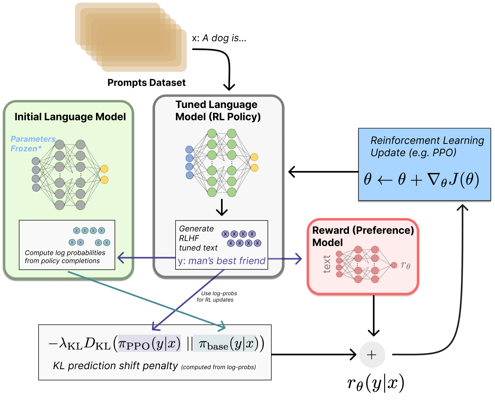
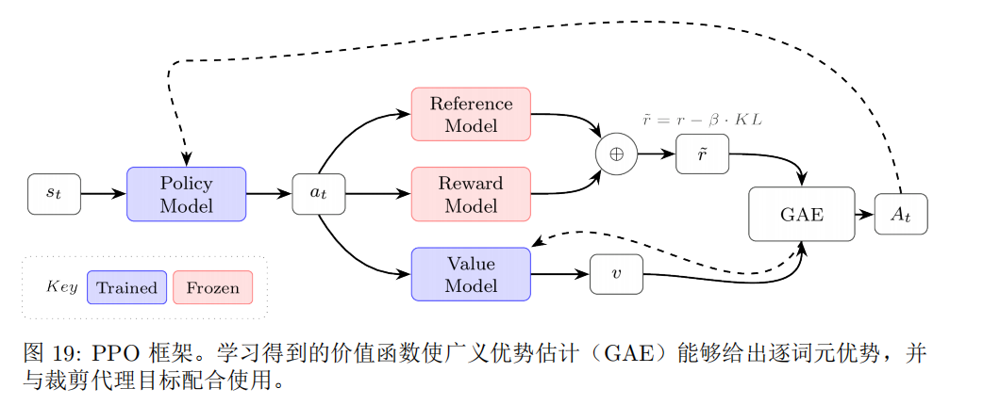

## 强化学习

### 策略梯度算法
>强化学习中策略梯度优化是指，通过优化策略函数的参数来寻求最优策略的一类方法。

我们先对优化目标$J(\theta)$做一个讨论。

自然地，定性为最大化给定状态分布以及当前策略$\pi_{\theta}$下状态价值的期望值。
由状态价值的定义$V_{\pi_{\theta}}(s)=\mathbb{E}_{\pi_{\theta}}(R(\tau)|s)$，这里的$R$是轨迹$\tau$的return
**随机性**，不难看出$J(\theta)=\mathbb{E}_sV_{\pi_{\theta}}(s)$有两层随机性，一是对状态s的随机，这个在实际中可以体现为从批次中采样$x_i$，二是对固定初始状态下的轨迹的随机，即固定$x_i$下生成不同回答$y_i$的可能性。

实际中，令$R(x_i,y_i)$为该轨迹下的return，具体的优化目标与批次和奖励的具体形式有关，比如可以对上述$R(x_i,y_i)$做批次平均。

>在将词元作为最小生成来作MDP推演时，一般将折扣因子设为1，因为我们关注的目标是生成整体。

#### 策略梯度的推导

令$p_{\theta}(\tau)$表示初始状态分布、策略以及环境共同诱导出的轨迹的概率分布（注意此处的$\tau$吸收了前述初始状态$s$的随机），从而有：
$$J(\theta)=\mathbb{E}_{\tau \sim p_{\theta}}[R(\tau)]$$

有$p_{\theta}(\tau)=d_0(s_0)\prod_{t=0}^{\infty}\pi_{\theta}(a_t|s_t)p(s_{t+1}|a_t,s_t)$

使用$\nabla f=f\nabla \text{log}f$的技巧，得到：

$$
\nabla_{\theta}J(\theta)=\mathbb{E}_{\tau \sim p_{\theta}}[R(\tau)\nabla_{\theta} \text{log}p_{\theta}(\tau)]
$$

简化中间过程，大致是$p$中只有$\pi$是含参的，化简之后得到：

$$
\nabla_{\theta}J(\theta)=\mathbb{E}_{\tau \sim p_{\theta}}[\Sigma_{t=0}^{\infty}R(\tau)\nabla_{\theta} \text{log}\pi_{\theta}(a_t|s_t)]
$$

，稍加推广得到:

$$
\nabla_{\theta}J(\theta)=\mathbb{E}_{\tau \sim p_{\theta}}[\Sigma_{t=0}^{\infty}\Psi_t\nabla_{\theta} \text{log}\pi_{\theta}(a_t|s_t)]
$$

其中，$\Psi_t$ 表示用于策略梯度估计的回报信号；有些奖励均采用折扣因子 $\gamma$。常见选择依次为：

1. **轨迹总回报**
   $$
   \Psi_t = R(\tau)=\sum_{t'=0}^{\infty}\gamma^{t'}r_{t'}.
   $$
   整条轨迹中的折扣奖励之和。

2. **从时刻 \(t\) 开始的回报**
   $$
   \Psi_t = G_t=\sum_{t'=t}^{\infty}\gamma^{t'-t}r_{t'}.
   $$
   表示执行动作 \(a_t\) 后、从当前时刻起获得的未来折扣回报。

3. **带基线的回报**
   $$
   \Psi_t = G_t-b(s_t).
   $$
   在回报中减去仅依赖状态的基线 \(b(s_t)\)，不会改变梯度估计的期望，但能降低方差。

4. **状态—动作价值**
   $$
   \Psi_t=Q^\pi(s_t,a_t).
   $$
   表示在状态 \(s_t\) 采取动作 \(a_t\) 后，后续回报的期望。

5. **优势函数**
   $$
   \Psi_t=A^\pi(s_t,a_t)=Q^\pi(s_t,a_t)-V^\pi(s_t).
   $$
   衡量动作 \(a_t\) 相对于该状态下策略平均表现的增益；若能准确估计，通常具有更低的梯度方差。

6. **时序差分（TD）残差**
   $$
   \Psi_t=\delta_t=r_t+\gamma V^\pi(s_{t+1})-V^\pi(s_t).
   $$
   它比较价值函数的当前预测与一步 bootstrap 目标，常用于近似优势函数。

其中，
$$
V^\pi(s_t)=\mathbb{E}_{a_t\sim\pi(\cdot\mid s_t)}[Q^\pi(s_t,a_t)]
$$
是状态价值，表示在 \(s_t\) 下遵循策略 \(\pi\) 的期望回报；而
$$
Q^\pi(s_t,a_t)=\mathbb{E}[r_t+\gamma V^\pi(s_{t+1})\mid s_t,a_t]
$$
是状态—动作价值。于是，优势函数可写为
$$
A^\pi(s_t,a_t)=r_t+\gamma V^\pi(s_{t+1})-V^\pi(s_t),
$$
即一步 TD 残差。*这是因为在确定性环境中，上式不再需要对状态转移取期望*。

#### 朴素策略梯度

一个关于时刻t的简单版本为：

$$
\nabla_{\theta}J(\theta)=\mathbb{E}_{\tau \sim p_{\theta}}[\Sigma_{t=0}^{T}G_t\nabla_{\theta} \text{log}\pi_{\theta}(a_t|s_t)]
$$

简单地用当前轨迹的生成token来进行计算，即$G_t=\Sigma_{k=t}^{T_i}\gamma^{k-1}r_{i,k}$。这里每个token的分数取决于怎么将RM的分数分配到每个分数上（比如中间token置0，只分配给最后的token）。

一个众所周知的问题，由于缺少基线，朴素策略梯度的方差极大，缓解的方式有优势函数（PPO），组平均值（GRPO）等。

#### REINFORCE留一法（RLOO）

优势$A_t=G_t-b(s_t)$

留一法的前提是：对一个提示生成了多条轨迹。

显然，即利用其余轨迹的均值作为当前轨迹return的基线。

>优势通过整个生成的奖励来计算，具体分不分配到token上是单纯的处理。一般会将并入KL惩罚后得到的优势广播到每个token

值得注意的是，RLOO以及传统的策略梯度将KL惩罚加到奖励上，而GRPO则在损失层面施加KL惩罚。

#### PPO近端策略优化

##### 价值网络
